# Luminus OS Images Architecture

This document describes how the Luminus OS image repository is organized, how the bootc images are built, how workstation artifacts are packaged, how the live ISO starts the installer, and how the installed system is prepared for first boot.

The repository currently has two active editions:

- `core`: shared Fedora bootc base image, published as `luminusos:<tag>`.
- `workstation`: GNOME desktop image, published as `luminusos-workstation:<tag>` and packaged as ISO and qcow2 artifacts.

Additional edition scaffolding should not be added unless package scope, target devices, installer behavior, and test coverage are part of the same design.

## Architecture Goals

- Build on Fedora bootc.
- Deliver systems as versioned OCI images.
- Keep a single workstation image for both the live ISO root and the installed bootc payload.
- Use ReadyMade only for the live ISO installation experience.
- Use GNOME Initial Setup after installation for creation of the real local user.
- Remove live-only state before the installed system reaches first user login.
- Keep Btrfs storage layout aligned across ReadyMade, image-builder, and local wrappers.
- Preserve bootc update behavior through the installed target image reference.

## High-Level View

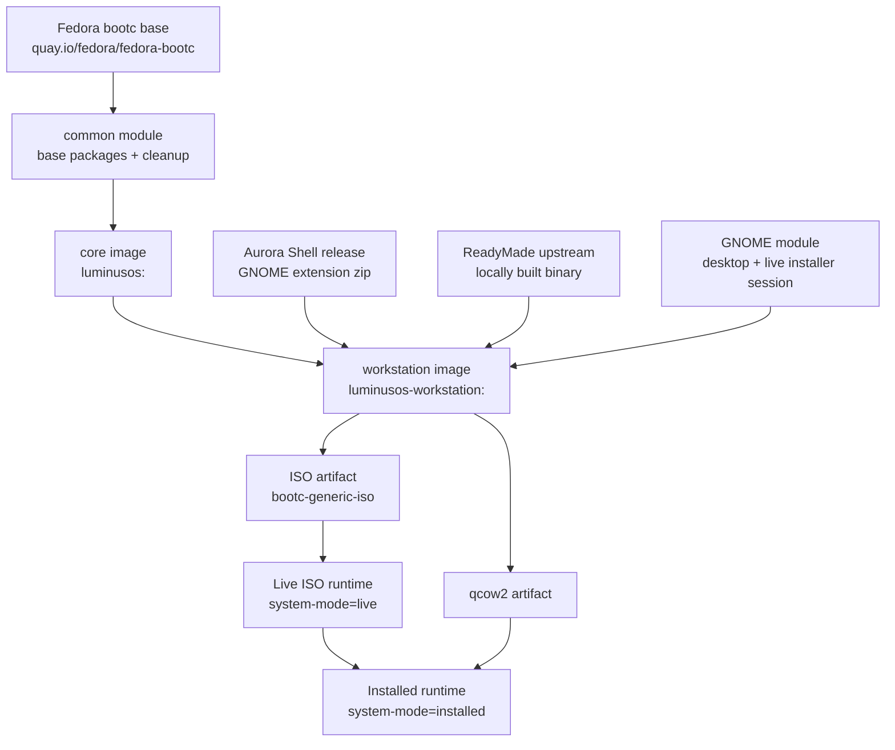

## Repository Layout

```text
.
├── AGENTS.md
├── ARCHITECTURE.md
├── Justfile
├── README.md
├── common/
│   ├── build.sh
│   ├── cleanup.sh
│   ├── finalize.sh
│   ├── flatpaks
│   ├── install-flatpaks.sh
│   └── recover-rpmdb.sh
├── desktops/
│   └── gnome/
│       ├── build.sh
│       └── files/
├── docs/
│   └── architecture.md
├── editions/
│   ├── core/
│   │   └── Containerfile
│   └── workstation/
│       └── Containerfile
└── tools/
    ├── install-qemu.sh
    └── qemu.sh
```

## Naming And Scope

| Area | Convention |
| --- | --- |
| Core image | `luminusos:<tag>` |
| Workstation image | `luminusos-workstation:<tag>` |
| Fedora version | Controlled by `LOS_FEDORA_VERSION`, default `44`. |
| Local tag | `<fedora>.<YYYYMMDD>` unless `LOS_TAG` is set. |
| Shared scripts | Stored in `common/` and called through `/ctx` in Containerfiles. |
| Desktop module | Stored in `desktops/gnome/`. |
| Static desktop files | Stored under `desktops/gnome/files/` and copied into `/`. |
| Artifact packaging | Handled by `image-builder` through `just package workstation`. |
| Local VM testing | Handled by `tools/qemu.sh` and `tools/install-qemu.sh`. |

## Build Inputs

| Variable | Default | Purpose |
| --- | --- | --- |
| `LOS_BASE` | `quay.io/fedora/fedora-bootc:44` | Base image for the core edition. |
| `LOS_FEDORA_VERSION` | `44` | Fedora release version used for DNF repos and tags. |
| `LOS_REGISTRY` | `localhost` | Registry prefix for local builds. |
| `LOS_TAG` | `<fedora>.<date>` | Build tag. |
| `LOS_NAME` | `LuminusOS` | OS name written to os-release. |
| `LOS_PRETTY_NAME` | `Luminus OS` | Pretty OS name written to os-release. |
| `LOS_WORKSTATION_TARGET_IMAGE` | local workstation image | Installed bootc update reference. |
| `AURORA_SHELL_VERSION` | `v50.3` | Aurora Shell release downloaded during build. |
| `LOS_FORCE_CORE` | `0` | Rebuild core even if the local stamp is unchanged. |
| `LOS_SKIP_FLATPAKS` | `0` | Skip Flatpak installation during workstation build. |

## Justfile Flow

The `Justfile` is the operational entry point. It computes image tags, rebuilds core when needed, packages artifacts, and starts local QEMU test flows.

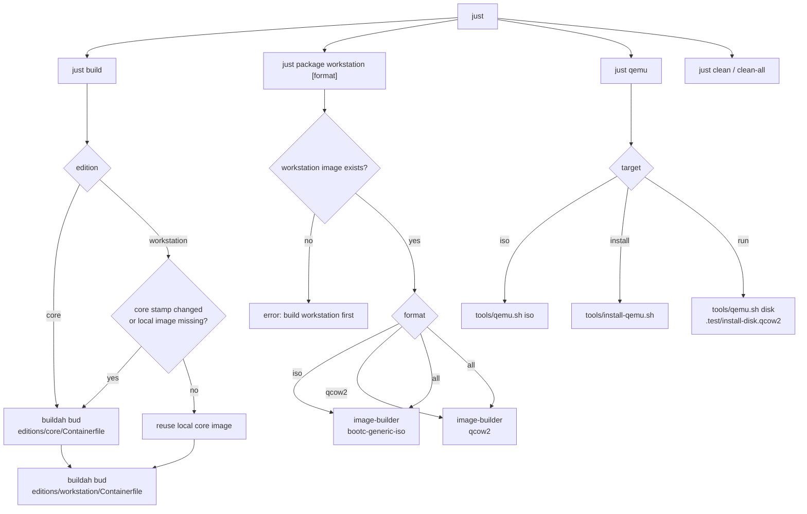

## Core Image

The core image is the shared bootc base. It starts from Fedora bootc and applies the common module.

Main file: `editions/core/Containerfile`.

Responsibilities:

- Set `/etc/dnf/vars/releasever` and `/etc/yum/vars/releasever`.
- Run `common/build.sh`.
- Install shared base packages: currently `NetworkManager` and `systemd-udev`.
- Update `/usr/lib/os-release` branding.
- Install `terra-release`.
- Run cleanup/finalization.
- Run `bootc container lint`.

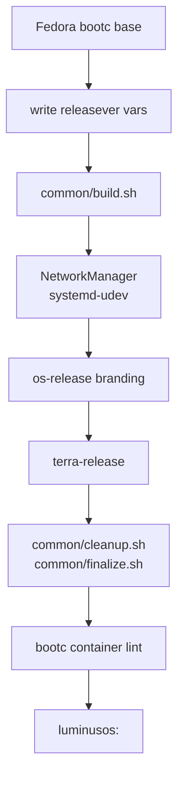

## Shared Scripts

| Script | Role |
| --- | --- |
| `common/build.sh` | Copies static `files/` content when present, recovers the RPM database, and installs shared base packages. |
| `common/recover-rpmdb.sh` | Recovers or rebuilds RPM database state for containerized builds. |
| `common/cleanup.sh` | Cleans DNF/libdnf caches and `/tmp` between layers. |
| `common/finalize.sh` | Performs final cleanup and prunes runtime `/var` state. |
| `common/install-flatpaks.sh` | Installs Flatpak, adds Flathub, and installs refs listed in `common/flatpaks`. |

## Workstation Image

The workstation image is built by `editions/workstation/Containerfile`. It is intentionally a single image used as:

- The live ISO root.
- The bootc payload installed by ReadyMade.
- The source image for qcow2 artifacts.

The Containerfile has four conceptual stages:

1. `ctx`: local repository context with `common/` and `desktops/`.
2. `aurora-extension`: downloads and validates the Aurora Shell extension zip.
3. `readymade-main`: builds ReadyMade from upstream source with local install-path adjustments.
4. Final workstation stage: starts from core and installs boot packages, Plymouth, GNOME, ReadyMade, Aurora Shell, Flatpaks, image-builder config, and wrappers.

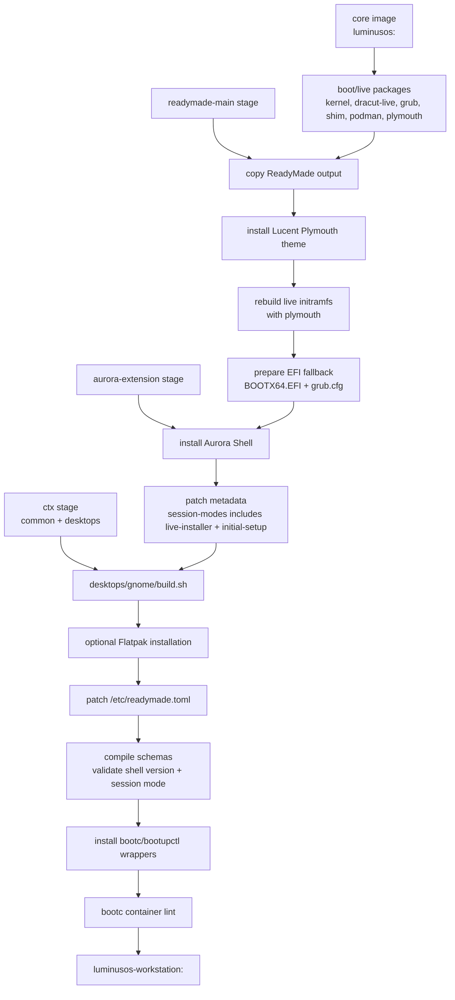

## Plymouth

The workstation image installs Plymouth and the `lucent` boot splash under `/usr/share/plymouth/themes/lucent`. The theme assets are adapted from the Plymouth theme in `https://github.com/luminusOS/orchiis`, but the local theme identity is `lucent`.

Runtime configuration:

- `/etc/plymouth/plymouthd.conf` sets `Theme=lucent`, `ShowDelay=0`, and `DeviceTimeout=8`.
- `/etc/dracut.conf.d/10-luminusos-plymouth.conf` forces Plymouth configuration into the initramfs.
- `/usr/lib/bootc/kargs.d/10-luminusos-splash.toml` provides default installed-system splash kernel arguments through bootc.
- `/usr/lib/image-builder/bootc/iso.yaml` provides the live ISO splash kernel arguments.

The live initramfs is rebuilt after Plymouth and the Lucent theme are installed so the live ISO can show the splash during early boot.

## Aurora Shell

Aurora Shell is installed from the release artifact selected by `AURORA_SHELL_VERSION`. The final image patches `metadata.json` so GNOME Shell accepts the extension in the normal user session, the custom live installer session, and GNOME Initial Setup:

```json
"session-modes": ["initial-setup", "live-installer", "user"]
```

The live installer shell mode inherits from `user` so the normal GNOME Shell extension system is active, then disables overview/run-dialog behavior for the installer session. The packaged GNOME Initial Setup shell mode is patched so Aurora Shell is included in its `enabledExtensions`.

| Runtime | Extension state | Module state |
| --- | --- | --- |
| Live ISO | Loaded in `live-installer` shell mode so its CSS is applied. | Modules are disabled through the live dconf database. |
| GNOME Initial Setup | Loaded in `initial-setup` shell mode. | Extension defaults apply. |
| Installed system | Loaded in normal `user` mode. | Extension defaults apply. |

Aurora Shell is enabled through GNOME Shell's native extension paths: live and Initial Setup sessions use their shell mode `enabledExtensions`, while normal user sessions use the image's compiled GNOME defaults and dconf defaults. No user service forces the extension on after login, so installed users can later change their extension state normally.

## ReadyMade Build Stage

The `readymade-main` stage builds ReadyMade from upstream source and installs it into `/out`.

Local build-time adjustments:

- Export only `.conf` repart files.
- Clean `/run/readymade-install` before ReadyMade recreates it.
- Pass kernel arguments into the bootc filesystem provisioner.
- Sort mounts before mount/unmount operations.
- Re-read partition tables after `systemd-repart`.
- Avoid panic if ReadyMade progress IPC disconnects before subprocess connection.
- Install the release binary and application resources into `/out`.

The final workstation stage copies `/out/` into the image.

## GNOME Desktop Module

Main file: `desktops/gnome/build.sh`.

Responsibilities:

- Copy `desktops/gnome/files/` into `/`.
- Install `accountsservice`, `gdm`, `gnome-initial-setup`, `gnome-shell`, `gnome-backgrounds`, and `gnome-software`.
- Prepare `/boot/efi` and `/boot/loader/entries`.
- Replace legacy live installer desktop entry behavior with ReadyMade.
- Keep ReadyMade visible in live mode only.
- Hide the packaged ReadyMade desktop file from the installed app grid.
- Disable GNOME Software autostart and search provider.
- Compile GLib schemas and update dconf.
- Set graphical boot and GDM display manager links.
- Enable installed first-boot cleanup fallback.
- Provide `/etc/hostname` from the static GNOME file tree.
- Create `liveuser`.
- Configure GDM autologin into `live-installer.desktop`.

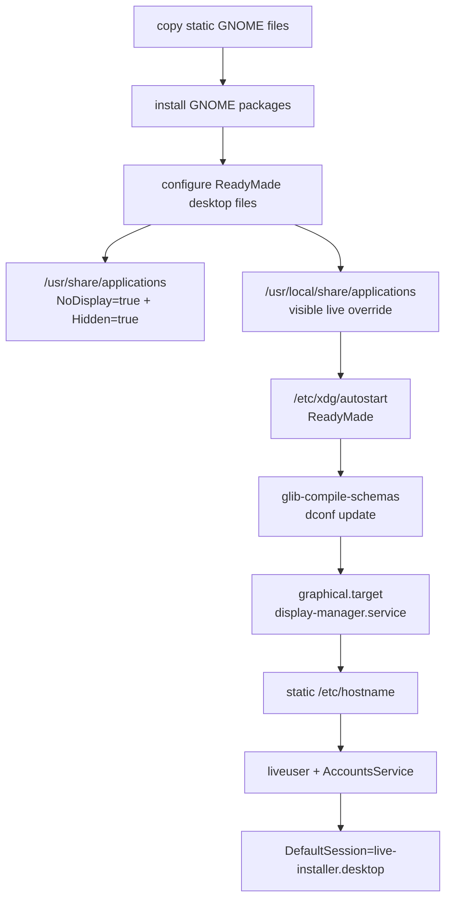

## Live ISO Runtime

The live ISO is not itself a bootc deployment. It is a live environment generated from the workstation image, and the same workstation image is embedded into container storage as the installable payload.

### Live-Only Files

| File | Purpose |
| --- | --- |
| `/etc/luminusos/system-mode` | Marks the runtime as `live`. |
| `/etc/gdm/custom.conf` | Enables `liveuser` autologin and selects `live-installer.desktop`. |
| `/var/lib/AccountsService/users/liveuser` | Pins `liveuser` to the installer session. |
| `/usr/share/wayland-sessions/live-installer.desktop` | Registers the Wayland session. |
| `/usr/share/gnome-session/sessions/live-installer.session` | Defines the GNOME session with `Kiosk=true`. |
| `/usr/lib/systemd/user/gnome-session@live-installer.target.d/live-installer.session.conf` | Requires GNOME Shell in `live-installer` mode and wants ReadyMade. |
| `/usr/share/gnome-shell/modes/live-installer.json` | Defines the custom shell mode and forces Aurora Shell enabled. |
| `/usr/lib/systemd/user/luminusos-readymade.service` | Starts ReadyMade in the live user session. |
| `/etc/dconf/db/local.d/00-luminusos-live` | Live favorites and Aurora Shell module defaults. |
| `/usr/local/share/applications/com.fyralabs.Readymade.desktop` | Live-only visible ReadyMade desktop entry. |

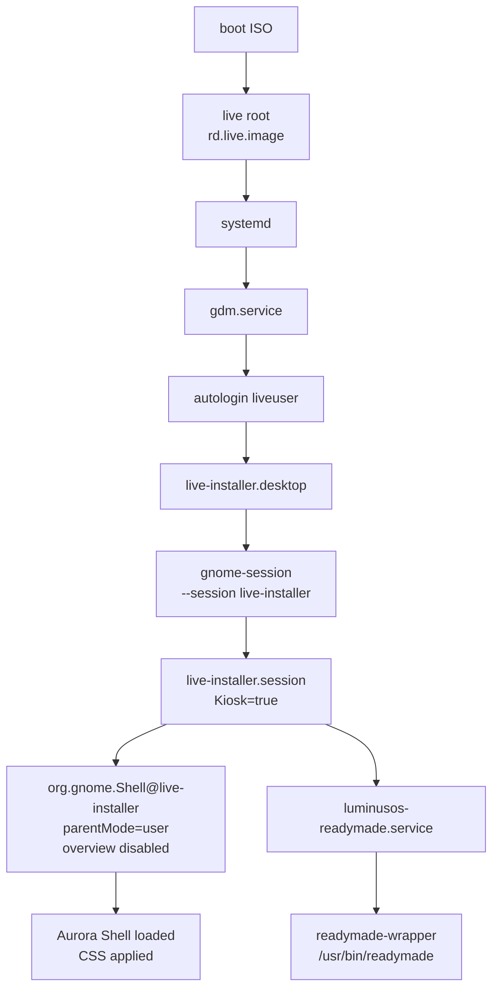

## Live Installer Session

The live installer session is named `live-installer`.

It combines:

- A Wayland session desktop file.
- A GNOME session file with `Kiosk=true`.
- A GNOME Shell mode file named `live-installer.json`.
- A user systemd target drop-in that starts Shell as `org.gnome.Shell@live-installer.service`.
- A user systemd service that starts ReadyMade.

The shell mode inherits from `user` to keep regular extension loading behavior. It then overrides the interactive surface so the installer session remains constrained:

- `hasOverview=false`
- `hasRunDialog=false`
- no left or center panel items
- right-side accessibility, keyboard, and quick settings items only
- Aurora Shell listed in `enabledExtensions`

## ReadyMade In The Live ISO

ReadyMade starts through `luminusos-readymade.service`, which executes `readymade-wrapper`.

The wrapper:

- Sets `TMPDIR=/run/readymade-tmp`.
- Keeps ReadyMade temporary files out of the live ISO root.
- Avoids `/run/readymade-install`, which ReadyMade reserves for repart staging.
- Forces `LANG=C.UTF-8` and `LC_ALL=C.UTF-8`.
- Executes `/usr/bin/readymade`.

Main install configuration in `/etc/readymade.toml`:

```toml
copy_mode = "bootc"
bootc_imgref = "containers-storage:<workstation-image>"
bootc_target_imgref = "<target-update-ref>"
bootc_enforce_sigpolicy = false
bootc_args = ["--skip-fetch-check", "--skip-finalize", "--bootupd-skip-boot-uuid"]
```

`bootc_imgref` points at the payload image embedded in the live ISO. `bootc_target_imgref` is the image reference the installed system should use for future updates.

## Installation Flow

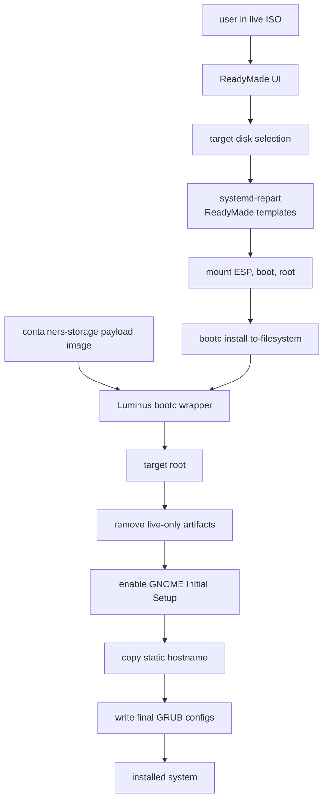

## Disk Layout

The storage model must remain aligned across:

- `--bootc-default-fs btrfs` in the `Justfile`.
- ReadyMade repart templates under `/usr/share/readymade/repart-cfgs/`.
- `/usr/lib/image-builder/bootc/disk.yaml`.

Expected layout:

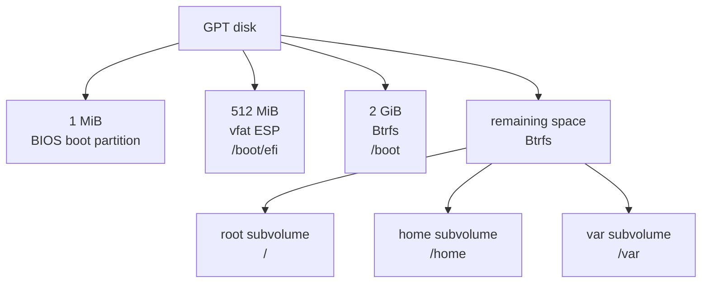

## Live-To-Installed Transition

Two cleanup paths exist:

1. `bootc-wrapper`, during installation before the first boot.
2. `installed-firstboot-cleanup`, as a fallback on the installed system's first boot.

Both paths remove live-only behavior and prepare GDM for GNOME Initial Setup.

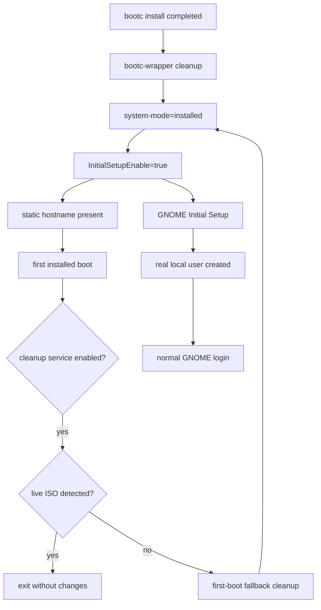

### Removed Live-Only Artifacts

The installed deployment removes:

- `/etc/readymade.toml`
- `/etc/xdg/autostart/com.fyralabs.Readymade.desktop`
- `/etc/polkit-1/rules.d/49-luminusos-readymade.rules`
- `/etc/dconf/db/local`
- `/etc/dconf/db/local.d/00-luminusos-live`
- `/etc/dconf/profile/user`
- live-visible `/usr/local/share/applications/com.fyralabs.Readymade.desktop` content, replaced with a `Hidden=true` override
- `/usr/lib/systemd/user/luminusos-readymade.service`
- `/usr/lib/systemd/user/gnome-session@live-installer.target.d/live-installer.session.conf`
- `/usr/share/gnome-shell/modes/live-installer.json`
- `/usr/share/gnome-session/sessions/live-installer.session`
- `/usr/share/wayland-sessions/live-installer.desktop`
- `/home/liveuser`
- `/var/home/liveuser`
- `liveuser` passwd, shadow, group, gshadow, subuid, subgid, and AccountsService entries

`/usr/bin/readymade` remains installed, but the packaged desktop entry is hidden from launchers with `NoDisplay=true` and `Hidden=true`. Installation cleanup also writes a hidden `/usr/local/share/applications/com.fyralabs.Readymade.desktop` override so the desktop file ID is treated as removed if a live-visible override survives into the target.

## GNOME Initial Setup

After installation:

- `/etc/gdm/custom.conf` contains `InitialSetupEnable=true`.
- The live session is removed.
- `liveuser` is removed.
- GDM starts GNOME Initial Setup so the real local user can be created.

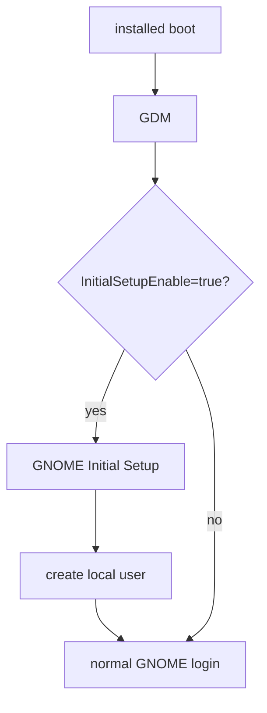

## Local Wrappers

The final workstation image replaces selected system binaries with wrappers and stores the original binaries under `/usr/libexec/luminusos/`.

| Wrapper | Real binary | Purpose |
| --- | --- | --- |
| `/usr/bin/bootc` | `/usr/libexec/luminusos/bootc-real` | Redirects install temp data to target storage, removes live artifacts from the target deployment, enables Initial Setup, and writes final GRUB configs. |
| `/usr/bin/bootupctl` | `/usr/libexec/luminusos/bootupctl-real` | Filters problematic bootupd flags during the live install path, writes GRUB static configs, and tolerates read-only bootc state write failures when appropriate. |
| `/usr/libexec/luminusos/readymade-wrapper` | `/usr/bin/readymade` | Sets live-safe temp and locale environment before starting ReadyMade. |

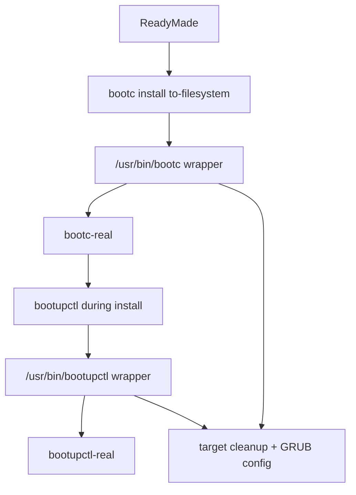

## Workstation Artifact Packaging

`just package workstation` calls `image-builder`.

### ISO

Conceptual command:

```bash
sudo image-builder build \
  --bootc-default-fs btrfs \
  --output-dir . \
  --output-name luminusos-workstation-<tag>.iso \
  --bootc-ref <workstation-image> \
  --bootc-installer-payload-ref <workstation-image> \
  bootc-generic-iso
```

`--bootc-ref` defines the live root. `--bootc-installer-payload-ref` embeds the same workstation image as the installer payload.

### qcow2

Conceptual command:

```bash
sudo image-builder build \
  --bootc-default-fs btrfs \
  --output-dir . \
  --output-name luminusos-workstation-<tag>.qcow2 \
  --bootc-ref <workstation-image> \
  qcow2
```

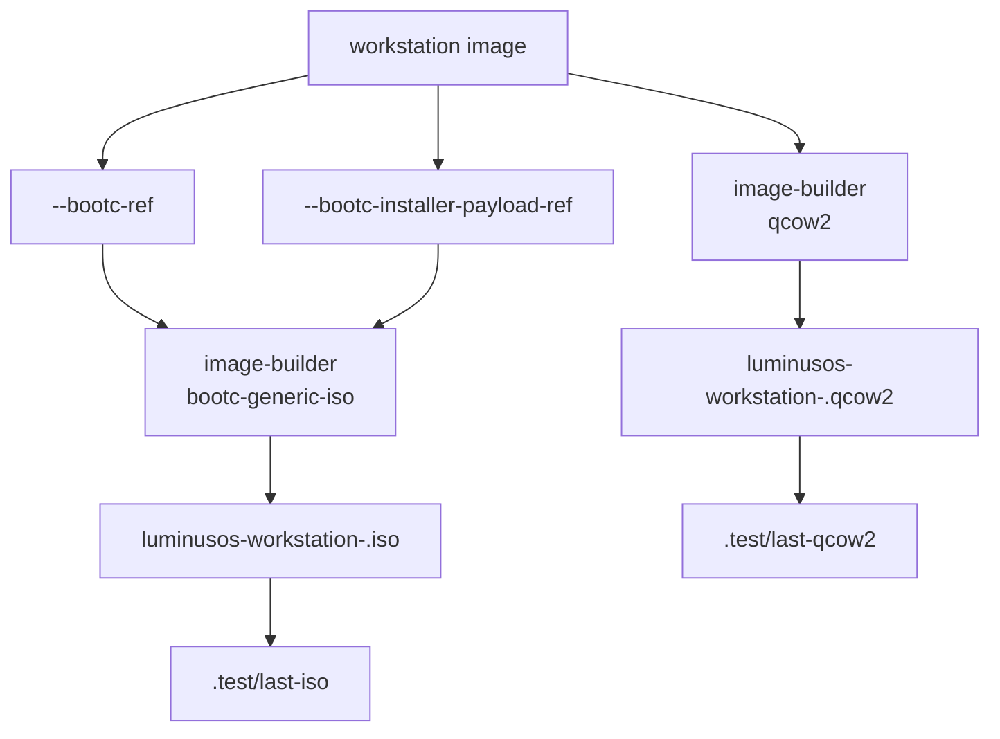

## Local QEMU Testing

The repository supports two local VM paths:

- Boot an ISO and install manually through ReadyMade.
- Install a bootc image directly into a qcow2 disk with bootc-image-builder, then boot that disk.

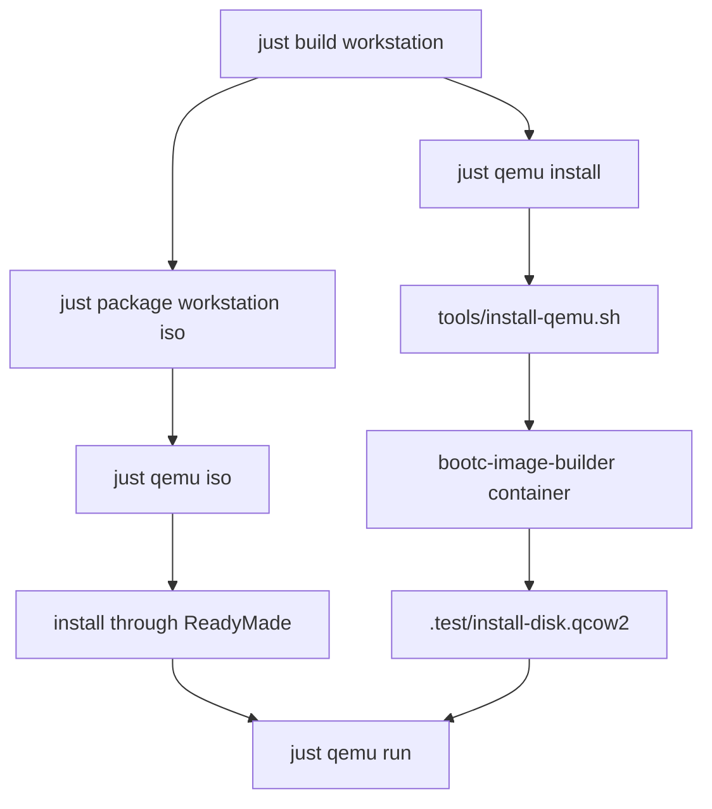

`tools/qemu.sh iso`:

- Selects ISO through `QEMU_ISO_PATH`, `.test/last-iso`, or the newest root-level ISO.
- Creates or reuses `.test/install-disk.qcow2`.
- Boots with OVMF UEFI by default.
- Uses AHCI/SATA by default for firmware compatibility.
- Enables serial logging and `.test/qemu.log` when `QEMU_DEBUG != 0`.

`tools/qemu.sh disk`:

- Boots `QEMU_DISK_PATH`, defaulting to `.test/disk.qcow2`.
- `just qemu run` uses `.test/install-disk.qcow2` and resets NVRAM by default.

`tools/install-qemu.sh`:

- Runs `quay.io/centos-bootc/bootc-image-builder:latest`.
- Mounts local container storage.
- Produces `.test/install-disk.qcow2`.

## Runtime States

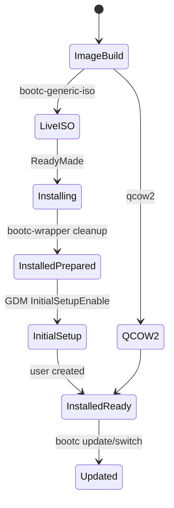

| State | Indicator | Behavior |
| --- | --- | --- |
| Live ISO | `/etc/luminusos/system-mode = live` | `liveuser` autologin, `live-installer` session, ReadyMade visible and autostarted. |
| Installed prepared | `/etc/luminusos/system-mode = installed` | Live artifacts removed, GNOME Initial Setup enabled. |
| Installed ready | Real user exists | Normal GNOME login, Aurora Shell defaults, ReadyMade hidden from app grid. |

## Updates

The installed system is a bootc deployment. Its update reference comes from `bootc_target_imgref` in `/etc/readymade.toml` during installation.

Local ISO builds normally use the local workstation tag. Release ISOs should set `LOS_WORKSTATION_TARGET_IMAGE` to a registry-published reference:

```bash
LOS_WORKSTATION_TARGET_IMAGE=ghcr.io/LuminusOS/luminusos-workstation:44
```


## Consistency Rules

When changing this repository, keep these points aligned:

- `Justfile`, `README.md`, `ARCHITECTURE.md`, and `docs/architecture.md` must agree on active commands and supported editions.
- `--bootc-default-fs btrfs`, ReadyMade repart templates, and `disk.yaml` must describe the same storage layout.
- Any live-only file added under `desktops/gnome/files/` should be removed by `bootc-wrapper`, removed by `installed-firstboot-cleanup`, and excluded by repart when applicable.
- Changes to `live-installer` must consider the Wayland session file, GNOME session file, GNOME Shell mode JSON, systemd user drop-in, Aurora Shell metadata, and cleanup paths.
- If the ReadyMade desktop file name changes, update GNOME build logic, autostart, cleanup, and repart exclusions.
- If the install flow changes, update `readymade.toml`, wrappers, and this document.

## Operational Commands

```bash
just build core
just build workstation
just package workstation
just package workstation iso
just package workstation qcow2
just qemu iso
just qemu install
just qemu run
```

Useful live ISO commands:

```bash
cat /etc/luminusos/system-mode
hostname
grep bootc_imgref /etc/readymade.toml
sudo podman images
sudo cat /tmp/readymade-logs*/readymade.log
journalctl -b -u gdm
journalctl -b --user -u luminusos-readymade.service
journalctl -b --user /usr/bin/gnome-shell
```

Useful installed-system commands:

```bash
cat /etc/luminusos/system-mode
hostname
bootc status
ls /usr/bin/readymade
grep -R "NoDisplay=true" /usr/share/applications/com.fyralabs.Readymade.desktop
grep -R "Hidden=true" /usr/local/share/applications/com.fyralabs.Readymade.desktop
```

## Known Constraints

- The live ISO itself is not a bootc deployment; `bootc status` is expected after installation.
- ReadyMade remains installed as a binary on the installed system, but it should not appear in the app grid.
- The `live-installer` session depends on a custom GNOME Shell mode; extensions used there must declare support for that mode.
- The install path relies on local wrappers to reconcile live ISO behavior, `bootc install`, and bootupd.
- The direct qcow2 test path does not exercise the ReadyMade UI.
