# Luminus OS Images Architecture

This document describes how the Luminus OS image repository is organized, how the bootc images are built, how workstation artifacts are packaged, how the live ISO starts the installer, and how the installed system is prepared for first boot.

The repository currently has two active editions:

- `core`: shared Fedora bootc base image, published as `luminusos:<tag>`.
- `workstation`: GNOME desktop image, published as `luminusos-workstation:<tag>` and packaged as ISO and qcow2 artifacts.

Additional edition scaffolding should not be added unless package scope, target devices, installer behavior, and test coverage are part of the same design.

## Architecture Goals

- Build on Fedora bootc.
- Deliver systems as versioned OCI images.
- Keep the installed workstation payload separate from the ISO live root image.
- Use Sirius only for the live ISO installation experience.
- Use GNOME Initial Setup after installation for creation of the real local user.
- Keep live-only state out of the installed workstation payload.
- Keep Btrfs storage layout aligned across the Sirius ISO install path and the qcow2 config.
- Preserve `bootc upgrade` behavior through the installed target image reference.
- Keep package installation as an image-build concern; package changes ship as a new OCI image via `bootc upgrade`.

## High-Level View

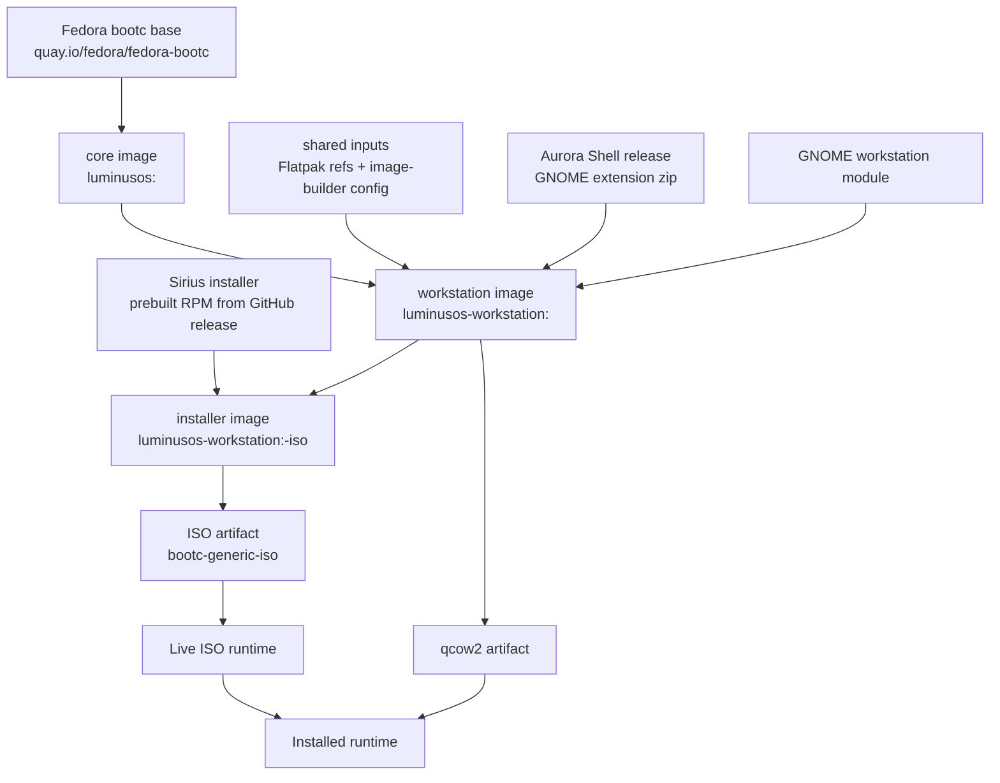

## Repository Layout

```text
.
├── AGENTS.md
├── ARCHITECTURE.md
├── Justfile
├── README.md
├── .just/
│   ├── build.just
│   ├── package.just
│   └── qemu.just
├── editions/
│   ├── cast/
│   ├── core/
│   │   └── Containerfile
│   ├── education/
│   ├── mobile/
│   ├── play/
│   └── workstation/
│       ├── Containerfile
│       ├── build.sh
│       └── files/
├── shared/
│   ├── bootc-image-builder.toml.example
│   ├── flatpaks
│   └── scripts/
└── tools/
    ├── install-qemu.sh
    └── qemu.sh
```

## Naming And Scope

| Area | Convention |
| --- | --- |
| Core image | `luminusos:<tag>` |
| Workstation image | `luminusos-workstation:<tag>` |
| Fedora version | Controlled by `LOS_FEDORA_VERSION`, default `44`. |
| Local tag | `<fedora>.<YYYYMMDD>` unless `LOS_TAG` is set. |
| Shared data/config | Stored in `shared/`; current shared inputs are Flatpak refs and bootc-image-builder config. |
| Desktop files | Stored under `editions/workstation/files/` and copied into `/`. |
| Desktop build script | `editions/workstation/build.sh`, called from the workstation Containerfile. |
| Artifact packaging | Handled by `image-builder` through `just package workstation`. |
| Local VM testing | Handled by `tools/qemu.sh` and `tools/install-qemu.sh`. |

## Build Inputs

| Variable | Default | Purpose |
| --- | --- | --- |
| `LOS_BASE` | `quay.io/fedora/fedora-bootc:44` | Base image for the core edition. |
| `LOS_FEDORA_VERSION` | `44` | Fedora release version used for DNF repos and tags. |
| `LOS_REGISTRY` | `localhost` | Registry prefix for local builds. |
| `LOS_TAG` | `<fedora>.<date>` | Build tag written to `VERSION`, `BUILD_ID`, `IMAGE_VERSION`, and bootloader entries. |
| `LOS_NAME` | `LuminusOS` | OS name written to os-release. |
| `LOS_PRETTY_NAME` | `Luminus OS` | Base pretty OS name; active editions append their edition name and `LOS_TAG` for bootloader entries. |
| `LOS_WORKSTATION_TARGET_IMAGE` | `ghcr.io/luminusos/luminusos-workstation:44` | Installed bootc update reference. |
| `AURORA_SHELL_VERSION` | `v50.3` | Aurora Shell release downloaded during build. |
| `LOS_FORCE_CORE` | `0` | Rebuild core even if the local stamp is unchanged. |
| `LOS_SKIP_FLATPAKS` | `0` | Skip Flatpak installation during workstation build. |

## Justfile Flow

The root `Justfile` is the operational entry point and keeps the shared image tags, cleanup, and quality recipes. The `.just/` directory separates the build, packaging, and QEMU flows into thematic modules while preserving the public commands documented below.

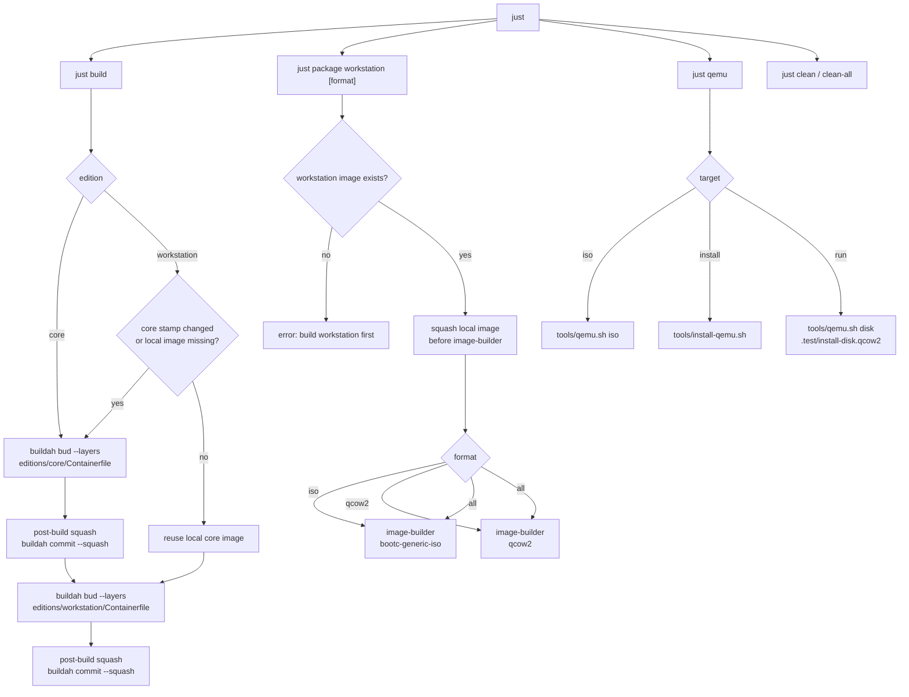

## Core Image

The core image is the shared bootc base. It starts from Fedora bootc and leaves downstream editions with a ready bootc foundation.

Main file: `editions/core/Containerfile`.

Responsibilities:

- Set `/etc/dnf/vars/releasever` and `/etc/yum/vars/releasever`.
- Inherit bootc base packages from Fedora bootc.
- Update `/usr/lib/os-release` branding and image version.
- Recover RPM database state when the container build path leaves a temporary rebuild database.
- Run final cleanup (DNF caches, logs, temporary files).
- Verify `bootc` is present and run `bootc container lint`.

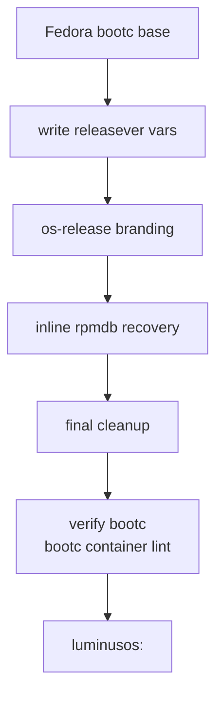

## Shared Data

| File | Role |
| --- | --- |
| `shared/flatpaks` | Flatpak refs installed into workstation unless `LOS_SKIP_FLATPAKS=1`; related refs are not preinstalled so GPU-specific runtimes are resolved on the installed system. |
| `shared/bootc-image-builder.toml.example` | Template for the gitignored local `shared/bootc-image-builder.toml` used by the direct QEMU install path (test user credentials stay out of git). |
| `shared/scripts/` | Build-time helper scripts (rpmdb repair, releasever pin, os-release branding, initramfs rebuild, session-modes patch) bind-mounted into every edition build. |

## Workstation Image

The workstation image is built by `editions/workstation/Containerfile`. It is used as:

- The bootc payload installed by Sirius.
- The source image for qcow2 artifacts.

The ISO live root is built by `editions/workstation/Containerfile.installer` as `luminusos-workstation:<tag>-iso`. It starts from the workstation image, then adds the live-only installer packages, Sirius, GNOME live session files, and the image-builder ISO config. The normal workstation image is also embedded as the install payload.

The workstation Containerfile has five conceptual stages:

1. `ctx-workstation-script`: edition build script context.
2. `ctx-flatpaks`: shared Flatpak refs from `shared/flatpaks`.
3. `ctx-files`: workstation static file context.
4. `aurora-extension`: downloads and validates the Aurora Shell extension zip.
5. Final workstation stage: starts from core and installs installed-system boot packages, Plymouth, GNOME, Aurora Shell, Flatpaks, qcow2 image-builder config, and first-boot cleanup.

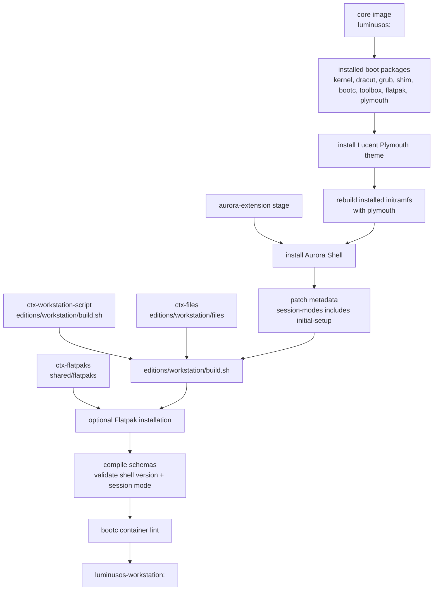

## Plymouth

The workstation image installs Plymouth and the `lucent` boot splash under `/usr/share/plymouth/themes/lucent`. The theme assets are adapted from the Plymouth theme in `https://github.com/luminusOS/orchiis`, but the local theme identity is `lucent`.

Runtime configuration:

- `/etc/plymouth/plymouthd.conf` sets `Theme=lucent`, `ShowDelay=0`, and `DeviceTimeout=8`.
- `/etc/dracut.conf.d/10-luminusos-plymouth.conf` forces Plymouth configuration into the initramfs.
- `/usr/lib/bootc/kargs.d/10-luminusos-splash.toml` provides default installed-system splash kernel arguments through bootc.
- `/usr/lib/image-builder/bootc/iso.yaml` in the installer image provides the live ISO splash kernel arguments.

The workstation initramfs is rebuilt without live modules. The installer image rebuilds its own initramfs with `dmsquash-live` modules so the ISO can boot as a live environment.

## Aurora Shell

Aurora Shell is installed from the release artifact selected by `AURORA_SHELL_VERSION`. The workstation image patches `metadata.json` for the normal user session and GNOME Initial Setup; the installer image adds the custom live installer session:

```json
"session-modes": ["initial-setup", "live-installer", "user"]
```

The live installer shell mode inherits from `user` so the normal GNOME Shell extension system is active, then disables overview/run-dialog behavior for the installer session. The packaged GNOME Initial Setup shell mode is patched so Aurora Shell is included in its `enabledExtensions`.

| Runtime | Extension state | Module state |
| --- | --- | --- |
| Live ISO | Loaded in `live-installer` shell mode so its CSS is applied. | Modules are disabled through the live dconf database. |
| GNOME Initial Setup | Loaded in `initial-setup` shell mode. | Extension defaults apply. |
| Installed system | Loaded in normal `user` mode. | Extension defaults apply. |

Aurora Shell is enabled through GNOME Shell's native extension paths: live and Initial Setup sessions use their shell mode `enabledExtensions`, while normal user sessions use the image's compiled GNOME defaults and dconf defaults. No user service forces the extension on after login, so installed users can later change their extension state normally.

## Installer Image

`editions/workstation/Containerfile.installer` builds the ISO live root from the workstation image. It adds live-only packages, installs Sirius from the prebuilt RPM published on the [sirius GitHub releases](https://github.com/luminusOS/sirius/releases), applies the live GNOME session, and installs the LuminusOS Sirius configuration. The image-builder ISO rootfs is sized large enough to copy the live root with Flatpaks and then carry the embedded workstation install payload.

The final stage squashes the live root into a single layer (`FROM scratch` + `COPY --from=live / /`). image-builder/osbuild deploys the ISO live root without applying OCI whiteout semantics, so layered input leaks `.wh.*` files from lower layers into the live rootfs as real, empty files. In the incident that motivated this, an empty `/usr/share/dbus-1/system.d/.wh.org.projectatomic.rpmostree1.conf` (from an rpm-ostree removal) broke dbus-broker and left the live boot on a black screen before GDM. The final verification step fails the build if any `.wh.*` file survives.

The Sirius RPM ships the binary, the polkit action, the desktop file, and generic default configs. The installer stage then replaces the generic configs with the LuminusOS ones: `/etc/sirius/distro.toml` and `/etc/sirius/sirius.toml` (templated with the payload image references), the LuminusOS repart templates under `/usr/share/sirius/repart.d/`, branding, and the live polkit rule.

## GNOME Workstation Setup

Main file: `editions/workstation/build.sh`.

Responsibilities:

- Install `accountsservice`, `gdm`, `gnome-initial-setup`, `gnome-shell`, `gnome-backgrounds`, `nautilus`, `sushi`, and `gnome-software`.
- Prepare `/boot/efi` and `/boot/loader/entries`.
- Disable GNOME Software autostart and search provider.
- Disable GNOME app folders so core apps such as Files and Software appear in the app grid directly.
- Compile GLib schemas and update dconf.
- Set graphical boot and GDM display manager links.
- Write installed defaults for `/etc/hostname` and GDM Initial Setup.

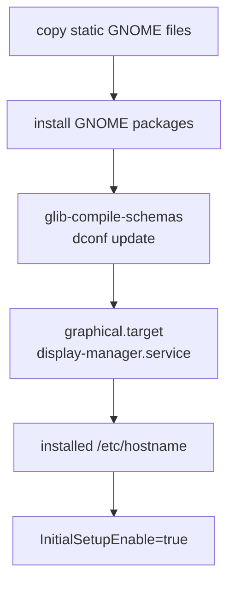

## Live ISO Runtime

The live ISO is not itself a bootc deployment. It is generated from the workstation installer image, and the normal workstation image is embedded into container storage as the installable payload.

### Live-Only Files

| File | Purpose |
| --- | --- |
| `/etc/hostname` | Marks the live root as `localhost-live`; the installed payload uses `luminus`. |
| `/etc/gdm/custom.conf` | Enables `liveuser` autologin and selects `live-installer.desktop`. |
| `/var/lib/AccountsService/users/liveuser` | Pins `liveuser` to the installer session. |
| `/usr/share/wayland-sessions/live-installer.desktop` | Registers the Wayland session. |
| `/usr/share/gnome-session/sessions/live-installer.session` | Defines the GNOME session with `Kiosk=true`. |
| `/usr/lib/systemd/user/gnome-session@live-installer.target.d/live-installer.session.conf` | Requires GNOME Shell in `live-installer` mode and wants Sirius. |
| `/usr/lib/systemd/user/gnome-session@live-installer.target.wants/luminusos-sirius.service` | Vendor-enables Sirius for the live installer session target. |
| `/usr/share/gnome-shell/modes/live-installer.json` | Defines the custom shell mode and forces Aurora Shell enabled. |
| `/usr/lib/systemd/user/luminusos-sirius.service` | Starts Sirius in the live user session. |
| `/etc/dconf/db/local.d/00-iso-live-mode` | Live ISO GNOME Shell and Aurora Shell module defaults. |
| `/usr/share/polkit-1/rules.d/50-sirius-live.rules` | Lets `liveuser` run the privileged Sirius install action without authentication. |

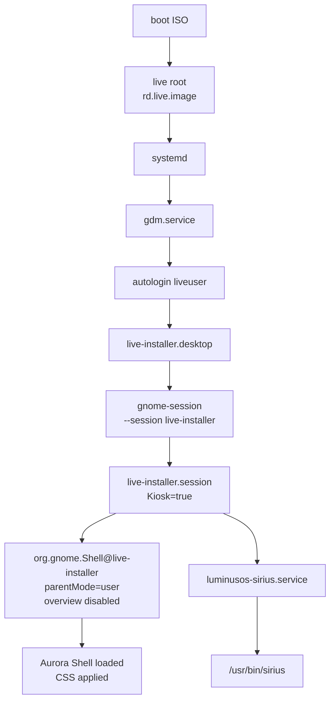

## Live Installer Session

The live installer session is named `live-installer`.

It combines:

- A Wayland session desktop file.
- A GNOME session file with `Kiosk=true`.
- A GNOME Shell mode file named `live-installer.json`.
- A user systemd target drop-in that starts Shell as `org.gnome.Shell@live-installer.service`.
- A user systemd service that starts Sirius (`luminusos-sirius.service`).

The shell mode inherits from `user` to keep regular extension loading behavior. It then overrides the interactive surface so the installer session remains constrained:

- `hasOverview=false`
- `hasRunDialog=false`
- no left or center panel items
- right-side accessibility, keyboard, and quick settings items only
- Aurora Shell listed in `enabledExtensions`

## Sirius In The Live ISO

Sirius starts through `luminusos-sirius.service`, which executes `/usr/bin/sirius` directly in the live user session. The unprivileged UI collects the user's choices; the actual install runs as `pkexec sirius run-playbook`, allowed without authentication for `liveuser` by `50-sirius-live.rules` (action id `io.sirius.Installer.run-playbook`).

Main install configuration in `/etc/sirius/distro.toml`:

```toml
[bootc]
image = "containers-storage:<workstation-image>"
target_imgref = "<target-update-ref>"
enforce_sigpolicy = false
kargs = ["rhgb", "quiet", "splash"]
args = ["--skip-fetch-check"]

[disk]
repart_dir = "/usr/share/sirius/repart.d"
```

`image` points at the payload embedded in the live ISO as an OCI layout (`oci:/usr/lib/luminusos/payload.oci:latest`, see [Install Memory Staging](#install-memory-staging)); `target_imgref` is the reference the installed system uses for future `bootc upgrade`. `/etc/sirius/sirius.toml` gates the wizard: keyboard/timezone/user pages are disabled (GNOME Initial Setup owns user creation) and diagnostics require UEFI, ≥2 GiB usable RAM, and enough disk space.

## Installation Flow

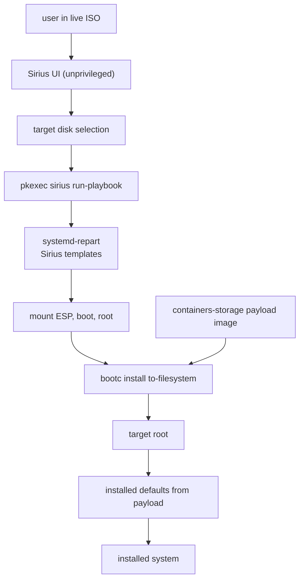

## Disk Layout

The Sirius ISO install storage model must remain aligned across:

- `/usr/lib/image-builder/bootc/disk.yaml` in the workstation image (btrfs root), which image-builder uses for both the ISO install path and direct qcow2 artifacts; it overrides `--bootc-default-fs`.
- Sirius repart templates under `/usr/share/sirius/repart.d/`.

Expected layout:

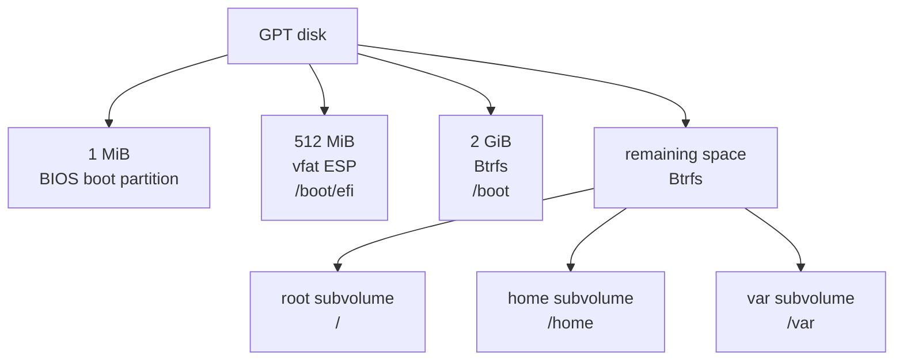

## Live-To-Installed Transition

The installed system comes from the normal workstation payload, not from the live ISO root. Live-only installer files stay out of the payload image: the payload never contained them, because Sirius, its configs, and the live session files are only added to the `-iso` live root image.

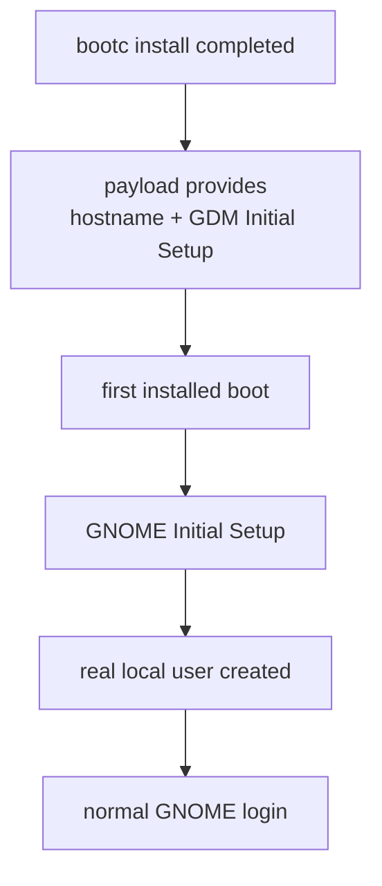

### Live-Only Isolation

The workstation payload never contains live-only installer artifacts: Sirius, its configs (`/etc/sirius/`), the live polkit rule, the `live-installer` session files, and the `liveuser` autologin setup are added only in `Containerfile.installer`, on top of the payload image. The bootc install path deploys the clean payload image, so no exclusion list is needed: live files simply never existed in the payload.

Sirius itself belongs to the installer image, not to the installed workstation payload.

## GNOME Initial Setup

After installation:

- `/etc/gdm/custom.conf` contains `InitialSetupEnable=true`.
- The installed payload does not ship the live installer session.
- The installed payload does not ship `liveuser`.
- GDM starts GNOME Initial Setup so the real local user can be created.

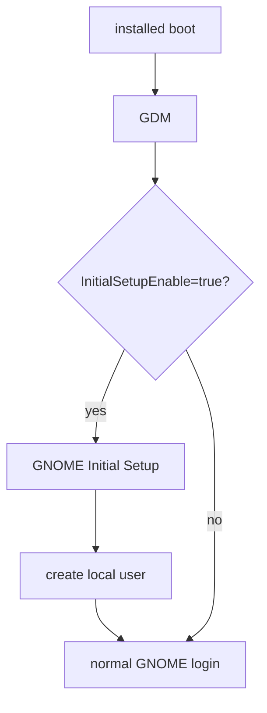

## Install Memory Staging

`bootc-generic-iso` can embed the installer payload as a `containers-storage` blob. `bootc install` can't stream that directly: containers/storage keeps layers already unpacked on disk, so install has to re-diff and re-tar each layer into a large `/var/tmp` staging area (~2.5 GiB compressed) before it can deploy them. On a live ISO, `/var/tmp` has nowhere to go but RAM, which is why installs used to need a dedicated tmpfs and a ~5 GiB RAM gate.

Instead, the payload is embedded in the `-iso` container image itself as an **OCI layout** at `/usr/lib/luminusos/payload.oci`. The build exports it into the build context beforehand (`skopeo copy <payload-image> oci:.test/payload.oci:latest` in the Justfile locally, a workflow step in CI) and `Containerfile.installer` copies it into the live root. OCI layout blobs are already ready-made layer tarballs, so `bootc install --source-imgref oci:/usr/lib/luminusos/payload.oci:latest` (set in `distro.toml`) streams them straight to the target disk, with no re-tar, no large staging area, and no image-builder payload-embedding support required at all.

The `:latest` suffix is load-bearing: `skopeo copy oci:...` strips it from the on-disk directory name and records it as the `org.opencontainers.image.ref.name` annotation in `index.json`, which is what makes the `:latest` reference resolvable. The container build fails its final verification if the annotation is missing.

The Sirius diagnostics gate (`min_ram_gib = 2`) only needs to cover the live GNOME session now.

## Workstation Artifact Packaging

`just package workstation` calls `image-builder`.

### ISO

Conceptual command:

```bash
sudo image-builder build \
  --output-dir . \
  --output-name luminusos-workstation-<tag>.iso \
  --bootc-ref <workstation-iso-image> \
  bootc-generic-iso
```

`--bootc-ref` defines the live root and points at `luminusos-workstation:<tag>-iso`. The installer payload is already embedded in that image as an OCI layout (see [Install Memory Staging](#install-memory-staging)), so no payload flag is passed to image-builder.

### qcow2

Conceptual command:

```bash
sudo image-builder build \
  --output-dir . \
  --output-name luminusos-workstation-<tag>.qcow2 \
  --bootc-ref <workstation-image> \
  qcow2
```

The direct qcow2 artifact uses `/usr/lib/image-builder/bootc/disk.yaml`. It keeps the root/home/var deployment on Btrfs, but `/boot` is ext4 because image-builder qcow2 generation does not support Btrfs for `/boot`.

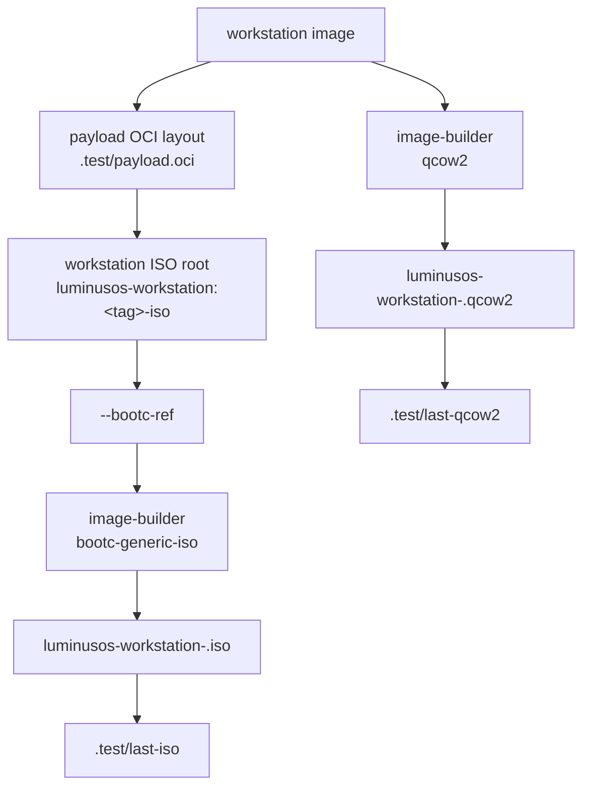

## Local QEMU Testing

The repository supports two local VM paths:

- Boot an ISO and install manually through Sirius.
- Install a bootc image directly into a qcow2 disk with bootc-image-builder, then boot that disk.

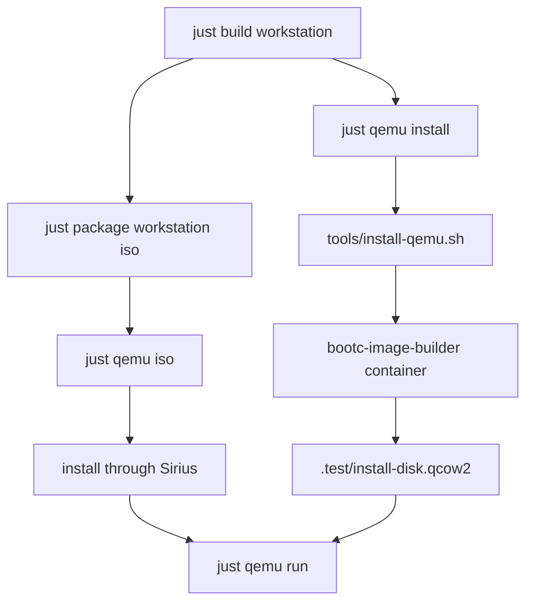

`tools/qemu.sh iso`:

- Selects ISO through `QEMU_ISO_PATH`, `.test/last-iso`, or the newest root-level ISO.
- Creates or reuses `.test/install-disk.qcow2`.
- Boots with OVMF UEFI by default.
- Uses AHCI/SATA by default for firmware compatibility.
- Enables serial logging and `.test/qemu.log` when `QEMU_DEBUG != 0`.

`tools/qemu.sh disk`:

- Boots `QEMU_DISK_PATH`, defaulting to `.test/disk.qcow2`.
- `just qemu run` uses `.test/install-disk.qcow2` and resets NVRAM by default.

`tools/install-qemu.sh`:

- Runs `quay.io/centos-bootc/bootc-image-builder:latest`.
- Mounts local container storage.
- Produces `.test/install-disk.qcow2`.

## Runtime States

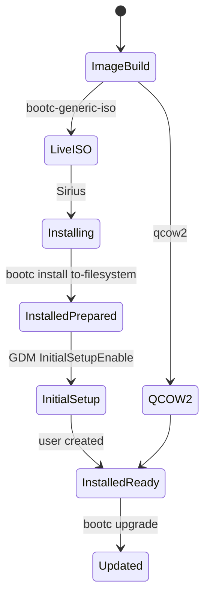

| State | Indicator | Behavior |
| --- | --- | --- |
| Live ISO | `/etc/hostname = localhost-live` | `liveuser` autologin, `live-installer` session, Sirius visible and autostarted. |
| Installed prepared | `/etc/gdm/custom.conf` with `InitialSetupEnable=true` | Workstation payload deployed, bootloader configured, GNOME Initial Setup enabled. |
| Installed ready | Real user exists | Normal GNOME login, Aurora Shell defaults, no Sirius installer app. |

## Updates

The installed system is a closed bootc deployment. Its update reference comes from `target_imgref` in `/etc/sirius/distro.toml` during installation, and normal updates are performed with `bootc upgrade` against that OCI reference.

Package changes must be made in the Containerfiles or build scripts and delivered as a new OCI image.

By default, installed systems track the Fedora-versioned workstation image in GHCR:

```bash
LOS_WORKSTATION_TARGET_IMAGE=ghcr.io/luminusos/luminusos-workstation:44
```

Local installer tests may override `LOS_WORKSTATION_TARGET_IMAGE`, but release builds should leave it on the registry-published reference so installed systems use `bootc upgrade` from the Luminus OS OCI registry.

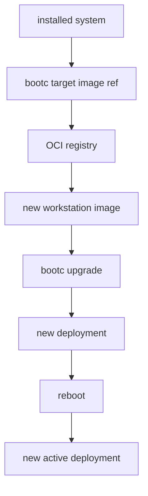

## Consistency Rules

When changing this repository, keep these points aligned:

- `Justfile`, `README.md`, `ARCHITECTURE.md`, and `AGENTS.md` must agree on active commands and supported editions.
- `disk.yaml` must keep root/home/var Btrfs with `/boot` ext4 (image-builder compatibility) and describe the same storage layout as the Sirius repart templates; image-builder takes the filesystem from `disk.yaml`, not from `--bootc-default-fs`.
- Any live-only file added under `editions/workstation/files/` must be installed only by `Containerfile.installer` so it stays out of the workstation payload.
- Changes to `live-installer` must consider the Wayland session file, GNOME session file, GNOME Shell mode JSON, systemd user drop-in, and Aurora Shell metadata.
- If the install flow changes, update `/etc/sirius/distro.toml` / `sirius.toml` and this document.

## Operational Commands

```bash
just build core
just build workstation
just package workstation
just package workstation iso
just package workstation qcow2
just qemu iso
just qemu install
just qemu run
```

Useful live ISO commands:

```bash
hostname
grep image /etc/sirius/distro.toml
sudo podman images
sudo cat /tmp/sirius-install-*.log
journalctl -b -u gdm
journalctl -b --user -u luminusos-sirius.service
journalctl -b --user /usr/bin/gnome-shell
```

Useful installed-system commands:

```bash
hostname
bootc status
test ! -e /usr/bin/sirius
test ! -e /usr/share/wayland-sessions/live-installer.desktop
test ! -e /etc/sirius/distro.toml
```

## Known Constraints

- The live ISO itself is not a bootc deployment; `bootc status` is expected after installation.
- Sirius is installed only in the ISO live root, not in the installed workstation payload.
- The `live-installer` session depends on a custom GNOME Shell mode; extensions used there must declare support for that mode.
- Installs need roughly 6 GB of RAM: the live session runs from memory and `bootc install` stages the payload in the live tmpfs `/var/tmp`.
- The direct qcow2 test path does not exercise the Sirius UI.
