# Luminus OS Images Architecture

This document describes how the Luminus OS image repository is organized, how the bootc images are built, how workstation artifacts are packaged, how the live ISO starts the installer, and how the installed system is prepared for first boot.

The repository currently has two active editions:

- `core`: shared Fedora bootc base image, published as `luminusos:<tag>`.
- `workstation`: GNOME desktop image, published as `luminusos-workstation:<tag>` and packaged as ISO and qcow2 artifacts.

Additional edition scaffolding should not be added unless package scope, target devices, installer behavior, and test coverage are part of the same design.

## Architecture Goals

- Build on Fedora bootc.
- Deliver systems as versioned OCI images.
- Keep the installed workstation payload separate from the ISO live root image.
- Use ReadyMade only for the live ISO installation experience.
- Use GNOME Initial Setup after installation for creation of the real local user.
- Remove live-only state before the installed system reaches first user login.
- Keep Btrfs storage layout aligned across the ReadyMade ISO install path and local wrappers.
- Preserve `bootc upgrade` behavior through the installed target image reference.
- Keep package installation as an image-build concern; installed systems do not ship the `rpm-ostree` client.

## High-Level View

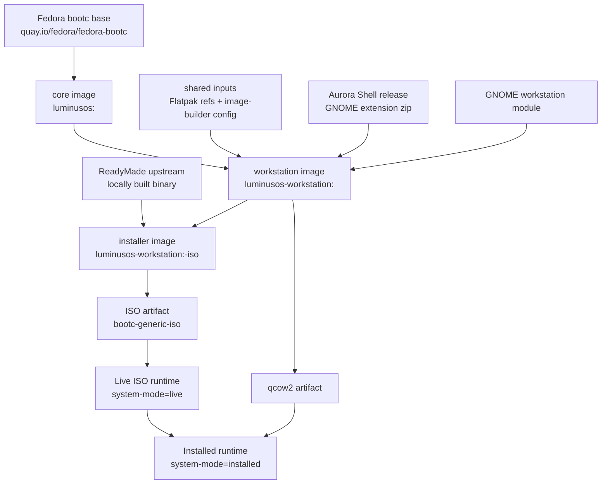

## Repository Layout

```text
.
├── AGENTS.md
├── ARCHITECTURE.md
├── Justfile
├── README.md
├── editions/
│   ├── cast/
│   ├── core/
│   │   └── Containerfile
│   ├── education/
│   ├── mobile/
│   ├── play/
│   └── workstation/
│       ├── Containerfile
│       ├── build.sh
│       └── files/
├── shared/
│   ├── bootc-image-builder.toml
│   └── flatpaks
└── tools/
    ├── install-qemu.sh
    └── qemu.sh
```

## Naming And Scope

| Area | Convention |
| --- | --- |
| Core image | `luminusos:<tag>` |
| Workstation image | `luminusos-workstation:<tag>` |
| Fedora version | Controlled by `LOS_FEDORA_VERSION`, default `44`. |
| Local tag | `<fedora>.<YYYYMMDD>` unless `LOS_TAG` is set. |
| Shared data/config | Stored in `shared/`; current shared inputs are Flatpak refs and bootc-image-builder config. |
| Desktop files | Stored under `editions/workstation/files/` and copied into `/`. |
| Desktop build script | `editions/workstation/build.sh`, called from the workstation Containerfile. |
| Artifact packaging | Handled by `image-builder` through `just package workstation`. |
| Local VM testing | Handled by `tools/qemu.sh` and `tools/install-qemu.sh`. |

## Build Inputs

| Variable | Default | Purpose |
| --- | --- | --- |
| `LOS_BASE` | `quay.io/fedora/fedora-bootc:44` | Base image for the core edition. |
| `LOS_FEDORA_VERSION` | `44` | Fedora release version used for DNF repos and tags. |
| `LOS_REGISTRY` | `localhost` | Registry prefix for local builds. |
| `LOS_TAG` | `<fedora>.<date>` | Build tag written to `VERSION`, `BUILD_ID`, `IMAGE_VERSION`, and bootloader entries. |
| `LOS_NAME` | `LuminusOS` | OS name written to os-release. |
| `LOS_PRETTY_NAME` | `Luminus OS` | Base pretty OS name; active editions append their edition name and `LOS_TAG` for bootloader entries. |
| `LOS_WORKSTATION_TARGET_IMAGE` | `ghcr.io/luminusos/luminusos-workstation:44` | Installed bootc update reference. |
| `AURORA_SHELL_VERSION` | `v50.3` | Aurora Shell release downloaded during build. |
| `LOS_FORCE_CORE` | `0` | Rebuild core even if the local stamp is unchanged. |
| `LOS_SKIP_FLATPAKS` | `0` | Skip Flatpak installation during workstation build. |
| `LOS_SQUASH` | `1` | Post-build squash the final local image to process OCI whiteouts before packaging; set `0` for faster dev-only builds. |

## Justfile Flow

The `Justfile` is the operational entry point. It computes image tags, rebuilds core when needed, packages artifacts, and starts local QEMU test flows.

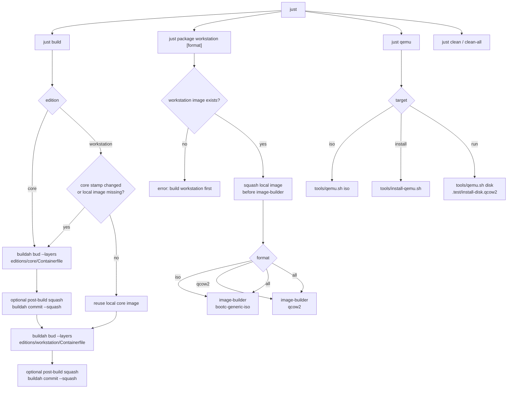

## Core Image

The core image is the shared bootc base. It starts from Fedora bootc and leaves downstream editions with a ready bootc foundation.

Main file: `editions/core/Containerfile`.

Responsibilities:

- Set `/etc/dnf/vars/releasever` and `/etc/yum/vars/releasever`.
- Inherit bootc base packages from Fedora bootc.
- Update `/usr/lib/os-release` branding and image version.
- Recover RPM database state when the container build path leaves a temporary rebuild database.
- Run final cleanup, including removal of `rpm-ostree`.
- Verify `bootc` is present, `rpm-ostree` is absent, and run `bootc container lint`.

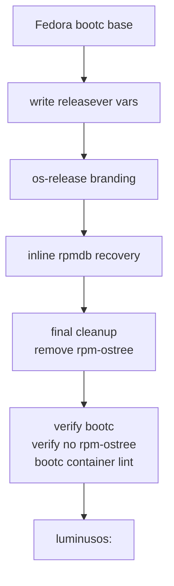

## Shared Data

| File | Role |
| --- | --- |
| `shared/flatpaks` | Flatpak refs installed into workstation unless `LOS_SKIP_FLATPAKS=1`; related refs are not preinstalled so GPU-specific runtimes are resolved on the installed system. |
| `shared/bootc-image-builder.toml` | Shared bootc-image-builder config used by the direct QEMU install path and available for future package flows. |

## Workstation Image

The workstation image is built by `editions/workstation/Containerfile`. It is used as:

- The bootc payload installed by ReadyMade.
- The source image for qcow2 artifacts.

The ISO live root is built by `editions/workstation/Containerfile.installer` as `luminusos-workstation:<tag>-iso`. It starts from the workstation image, then adds the live-only installer packages, ReadyMade, GNOME live session files, image-builder ISO config, and boot/install wrappers. The normal workstation image is also embedded as the install payload.

The workstation Containerfile has five conceptual stages:

1. `ctx-workstation-script`: edition build script context.
2. `ctx-flatpaks`: shared Flatpak refs from `shared/flatpaks`.
3. `ctx-files`: workstation static file context.
4. `aurora-extension`: downloads and validates the Aurora Shell extension zip.
5. Final workstation stage: starts from core and installs installed-system boot packages, Plymouth, GNOME, Aurora Shell, Flatpaks, qcow2 image-builder config, and first-boot cleanup.

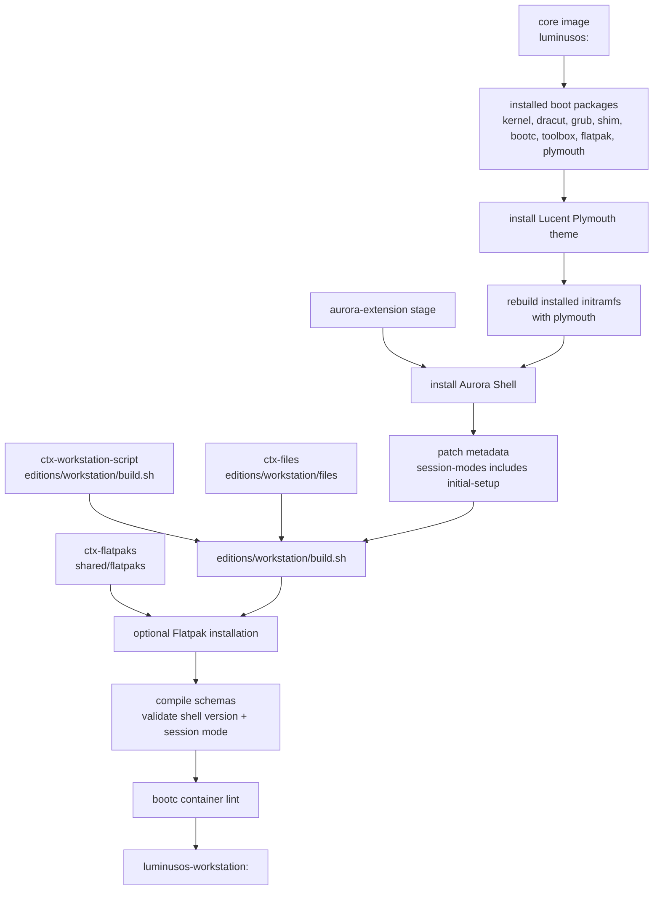

## Plymouth

The workstation image installs Plymouth and the `lucent` boot splash under `/usr/share/plymouth/themes/lucent`. The theme assets are adapted from the Plymouth theme in `https://github.com/luminusOS/orchiis`, but the local theme identity is `lucent`.

Runtime configuration:

- `/etc/plymouth/plymouthd.conf` sets `Theme=lucent`, `ShowDelay=0`, and `DeviceTimeout=8`.
- `/etc/dracut.conf.d/10-luminusos-plymouth.conf` forces Plymouth configuration into the initramfs.
- `/usr/lib/bootc/kargs.d/10-luminusos-splash.toml` provides default installed-system splash kernel arguments through bootc.
- `/usr/lib/image-builder/bootc/iso.yaml` in the installer image provides the live ISO splash kernel arguments.

The workstation initramfs is rebuilt without live modules. The installer image rebuilds its own initramfs with `dmsquash-live` modules so the ISO can boot as a live environment.

## Aurora Shell

Aurora Shell is installed from the release artifact selected by `AURORA_SHELL_VERSION`. The workstation image patches `metadata.json` for the normal user session and GNOME Initial Setup; the installer image adds the custom live installer session:

```json
"session-modes": ["initial-setup", "live-installer", "user"]
```

The live installer shell mode inherits from `user` so the normal GNOME Shell extension system is active, then disables overview/run-dialog behavior for the installer session. The packaged GNOME Initial Setup shell mode is patched so Aurora Shell is included in its `enabledExtensions`.

| Runtime | Extension state | Module state |
| --- | --- | --- |
| Live ISO | Loaded in `live-installer` shell mode so its CSS is applied. | Modules are disabled through the live dconf database. |
| GNOME Initial Setup | Loaded in `initial-setup` shell mode. | Extension defaults apply. |
| Installed system | Loaded in normal `user` mode. | Extension defaults apply. |

Aurora Shell is enabled through GNOME Shell's native extension paths: live and Initial Setup sessions use their shell mode `enabledExtensions`, while normal user sessions use the image's compiled GNOME defaults and dconf defaults. No user service forces the extension on after login, so installed users can later change their extension state normally.

## Installer Image

`editions/workstation/Containerfile.installer` builds the ISO live root from the workstation image. It adds live-only packages, copies ReadyMade into the image, applies the live GNOME session, and installs the wrappers that are only needed during installation. The image-builder ISO rootfs is sized large enough to also carry the embedded workstation install payload.

Its `readymade-main` stage builds ReadyMade from upstream source and installs it into `/out`. Local build-time adjustments:

- Export only `.conf` repart files.
- Clean `/run/readymade-install` before ReadyMade recreates it.
- Pass kernel arguments into the bootc filesystem provisioner.
- Sort mounts before mount/unmount operations.
- Re-read partition tables after `systemd-repart`.
- Avoid panic if ReadyMade progress IPC disconnects before subprocess connection.
- Install the release binary and application resources into `/out`.

The final installer stage copies `/out/` into the `luminusos-workstation:<tag>-iso` image.

## GNOME Workstation Setup

Main file: `editions/workstation/build.sh`.

Responsibilities:

- Install `accountsservice`, `gdm`, `gnome-initial-setup`, `gnome-shell`, `gnome-backgrounds`, `nautilus`, `sushi`, and `gnome-software`.
- Prepare `/boot/efi` and `/boot/loader/entries`.
- Disable GNOME Software autostart and search provider.
- Disable GNOME app folders so core apps such as Files and Software appear in the app grid directly.
- Compile GLib schemas and update dconf.
- Set graphical boot and GDM display manager links.
- Enable installed first-boot cleanup fallback.
- Write installed defaults for `/etc/hostname`, `/etc/luminusos/system-mode`, and GDM Initial Setup.

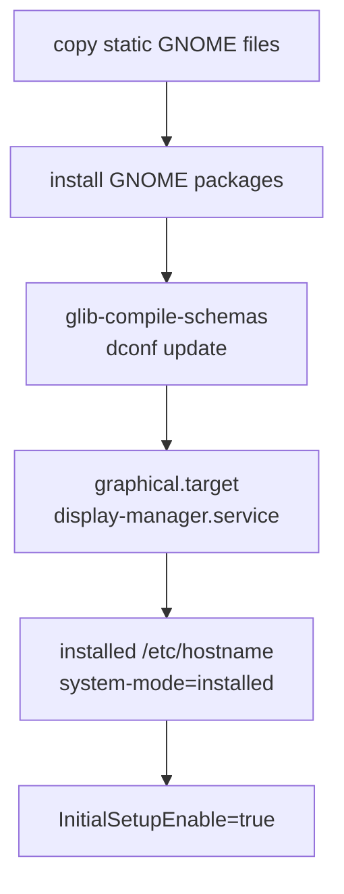

## Live ISO Runtime

The live ISO is not itself a bootc deployment. It is generated from the workstation installer image, and the normal workstation image is embedded into container storage as the installable payload.

### Live-Only Files

| File | Purpose |
| --- | --- |
| `/etc/luminusos/system-mode` | Marks the runtime as `live`. |
| `/etc/gdm/custom.conf` | Enables `liveuser` autologin and selects `live-installer.desktop`. |
| `/var/lib/AccountsService/users/liveuser` | Pins `liveuser` to the installer session. |
| `/usr/share/wayland-sessions/live-installer.desktop` | Registers the Wayland session. |
| `/usr/share/gnome-session/sessions/live-installer.session` | Defines the GNOME session with `Kiosk=true`. |
| `/usr/lib/systemd/user/gnome-session@live-installer.target.d/live-installer.session.conf` | Requires GNOME Shell in `live-installer` mode and wants ReadyMade. |
| `/usr/lib/systemd/user/gnome-session@live-installer.target.wants/luminusos-readymade.service` | Vendor-enables ReadyMade for the live installer session target. |
| `/usr/share/gnome-shell/modes/live-installer.json` | Defines the custom shell mode and forces Aurora Shell enabled. |
| `/usr/lib/systemd/user/luminusos-readymade.service` | Starts ReadyMade in the live user session. |
| `/etc/dconf/db/local.d/00-iso-live-mode` | Live ISO GNOME Shell and Aurora Shell module defaults. |
| `/etc/xdg/autostart/com.fyralabs.Readymade.desktop` | Live-only ReadyMade desktop autostart entry. |

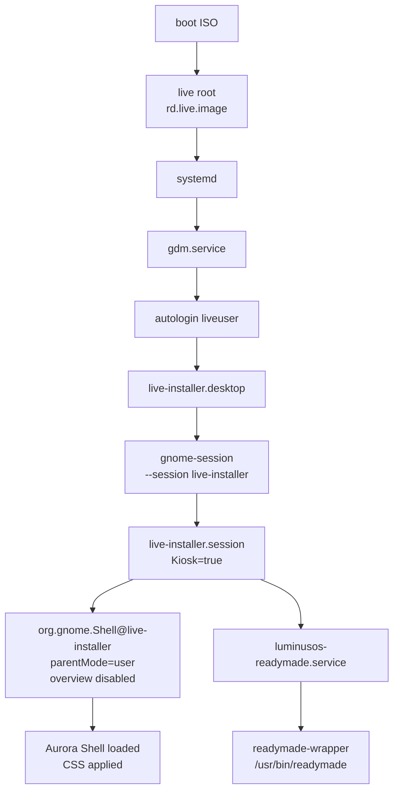

## Live Installer Session

The live installer session is named `live-installer`.

It combines:

- A Wayland session desktop file.
- A GNOME session file with `Kiosk=true`.
- A GNOME Shell mode file named `live-installer.json`.
- A user systemd target drop-in that starts Shell as `org.gnome.Shell@live-installer.service`.
- A user systemd service that starts ReadyMade.

The shell mode inherits from `user` to keep regular extension loading behavior. It then overrides the interactive surface so the installer session remains constrained:

- `hasOverview=false`
- `hasRunDialog=false`
- no left or center panel items
- right-side accessibility, keyboard, and quick settings items only
- Aurora Shell listed in `enabledExtensions`

## ReadyMade In The Live ISO

ReadyMade starts through `luminusos-readymade.service`, which executes `readymade-wrapper`.

The wrapper:

- Sets `TMPDIR=/run/readymade-tmp`.
- Keeps ReadyMade temporary files out of the live ISO root.
- Avoids `/run/readymade-install`, which ReadyMade reserves for repart staging.
- Forces `LANG=C.UTF-8` and `LC_ALL=C.UTF-8`.
- Executes `/usr/bin/readymade`.

Main install configuration in `/etc/readymade.toml`:

```toml
copy_mode = "bootc"
bootc_imgref = "containers-storage:<workstation-image>"
bootc_target_imgref = "<target-update-ref>"
bootc_enforce_sigpolicy = false
bootc_args = ["--skip-fetch-check", "--skip-finalize", "--bootupd-skip-boot-uuid", "--bootloader", "none"]
```

`bootc_imgref` points at the payload image embedded in the live ISO. `bootc_target_imgref` is the image reference the installed system should use for future updates. The live install path disables bootc's internal bootloader call so `bootc-wrapper` can keep image import temp data on the target disk, run bootupctl without the static-config arguments that fail under the ReadyMade filesystem install path, then write the final GRUB configs itself.

## Installation Flow

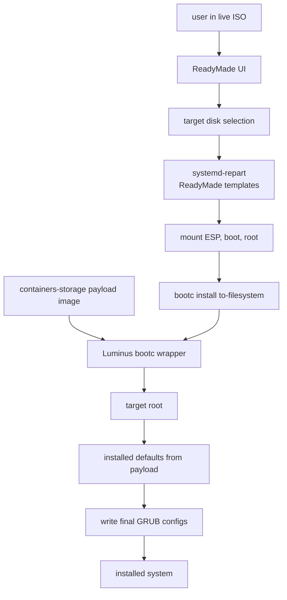

## Disk Layout

The ReadyMade ISO install storage model must remain aligned across:

- `--bootc-default-fs btrfs` in the `Justfile`.
- ReadyMade repart templates under `/usr/share/readymade/repart-cfgs/`.

Expected layout:

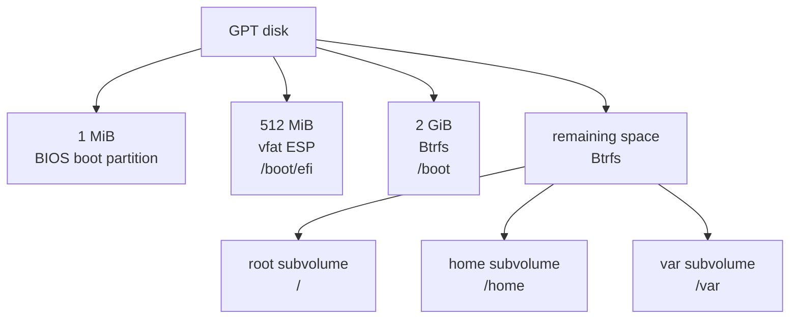

## Live-To-Installed Transition

The installed system comes from the normal workstation payload, not from the live ISO root. Live-only installer files should therefore stay out of the payload image. `bootc-wrapper` only handles target-backed temp storage and final bootloader setup during installation. `installed-firstboot-cleanup` remains as a first-boot fallback for stale mutable state from older installer images or interrupted tests.

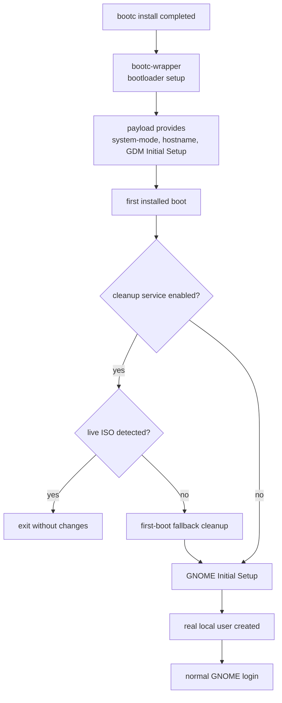

### Fallback Live-Only Cleanup

The workstation payload should not contain live-only installer artifacts. If an older installer image or interrupted test leaves stale live state in mutable target paths, `installed-firstboot-cleanup` removes:

- `/etc/readymade.toml`
- `/etc/xdg/autostart/com.fyralabs.Readymade.desktop`
- `/etc/polkit-1/rules.d/49-luminusos-readymade.rules`
- `/etc/dconf/db/local`
- `/etc/dconf/db/local.d/00-iso-live-mode`
- `/etc/dconf/profile/user`
- stale `/usr/local/share/applications/com.fyralabs.Readymade.desktop` or `/var/usrlocal/share/applications/com.fyralabs.Readymade.desktop` content, replaced with a `Hidden=true` override when writable
- `/usr/lib/systemd/user/luminusos-readymade.service`
- `/usr/lib/systemd/user/gnome-session@live-installer.target.d/live-installer.session.conf`
- `/usr/share/gnome-shell/modes/live-installer.json`
- `/usr/share/gnome-session/sessions/live-installer.session`
- `/usr/share/wayland-sessions/live-installer.desktop`
- `/home/liveuser`
- `/var/home/liveuser`
- `liveuser` passwd, shadow, group, gshadow, subuid, subgid, and AccountsService entries

The fallback also hides stale `/usr/local` or `/var/usrlocal` ReadyMade desktop entries if an older live-visible override survives into the target. ReadyMade itself belongs to the installer image, not to the installed workstation payload.

## GNOME Initial Setup

After installation:

- `/etc/gdm/custom.conf` contains `InitialSetupEnable=true`.
- The installed payload does not ship the live installer session.
- The installed payload does not ship `liveuser`.
- GDM starts GNOME Initial Setup so the real local user can be created.

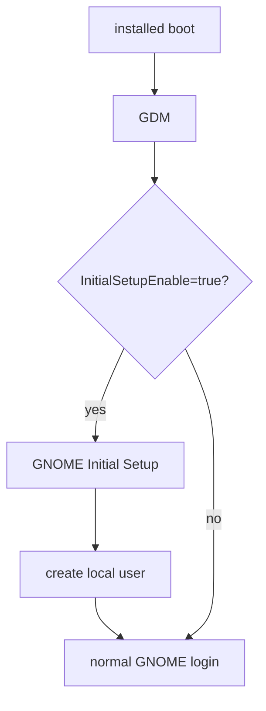

## Installer Wrappers

The installer image replaces `bootc` with a wrapper and stores the original binary under `/usr/libexec/luminusos/`. It does not replace `bootupctl`; the bootc wrapper invokes the normal `/usr/bin/bootupctl` after `bootc install to-filesystem` succeeds.

| Wrapper | Real binary | Purpose |
| --- | --- | --- |
| `/usr/bin/bootc` | `/usr/libexec/luminusos/bootc-real` | Redirects install temp data to target storage, runs bootupctl after bootc install, and writes final GRUB configs. |
| `/usr/libexec/luminusos/readymade-wrapper` | `/usr/bin/readymade` | Sets live-safe temp and locale environment before starting ReadyMade. |

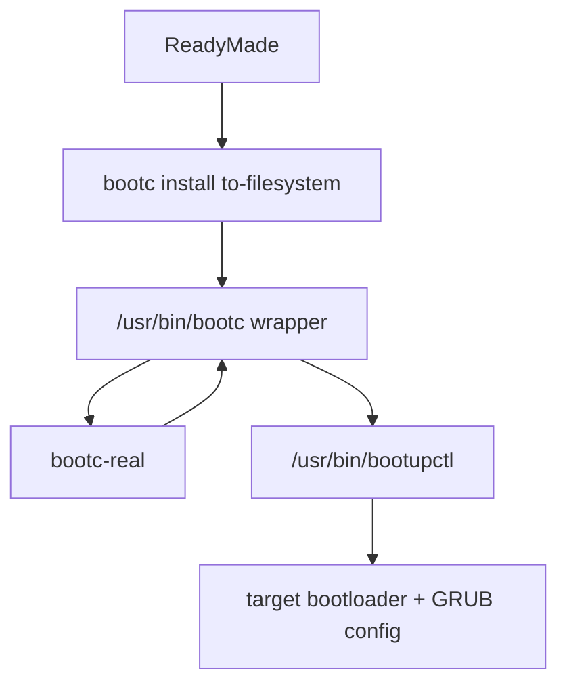

## Workstation Artifact Packaging

`just package workstation` calls `image-builder`.

### ISO

Conceptual command:

```bash
sudo image-builder build \
  --bootc-default-fs btrfs \
  --output-dir . \
  --output-name luminusos-workstation-<tag>.iso \
  --bootc-ref <workstation-iso-image> \
  --bootc-installer-payload-ref <workstation-image> \
  bootc-generic-iso
```

`--bootc-ref` defines the live root and points at `luminusos-workstation:<tag>-iso`. `--bootc-installer-payload-ref` embeds the normal `luminusos-workstation:<tag>` image as the installer payload.

### qcow2

Conceptual command:

```bash
sudo image-builder build \
  --bootc-default-fs btrfs \
  --output-dir . \
  --output-name luminusos-workstation-<tag>.qcow2 \
  --bootc-ref <workstation-image> \
  qcow2
```

The direct qcow2 artifact uses `/usr/lib/image-builder/bootc/disk.yaml`. It keeps the root/home/var deployment on Btrfs, but `/boot` is ext4 because image-builder qcow2 generation does not support Btrfs for `/boot`.

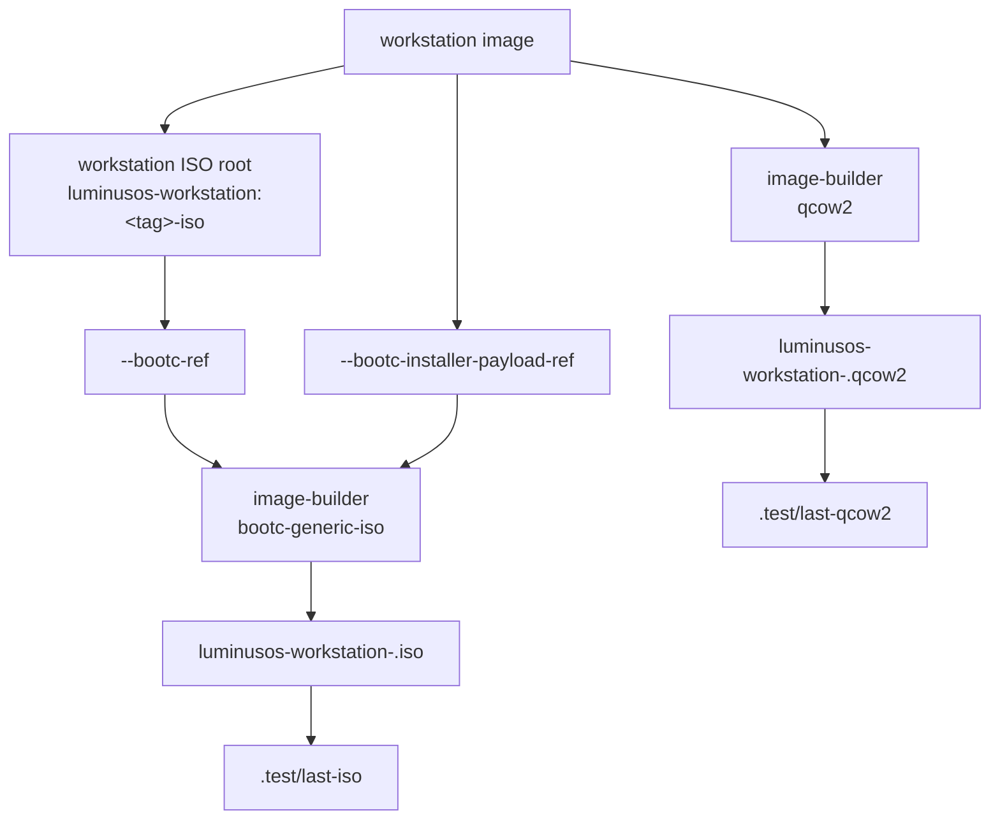

## Local QEMU Testing

The repository supports two local VM paths:

- Boot an ISO and install manually through ReadyMade.
- Install a bootc image directly into a qcow2 disk with bootc-image-builder, then boot that disk.

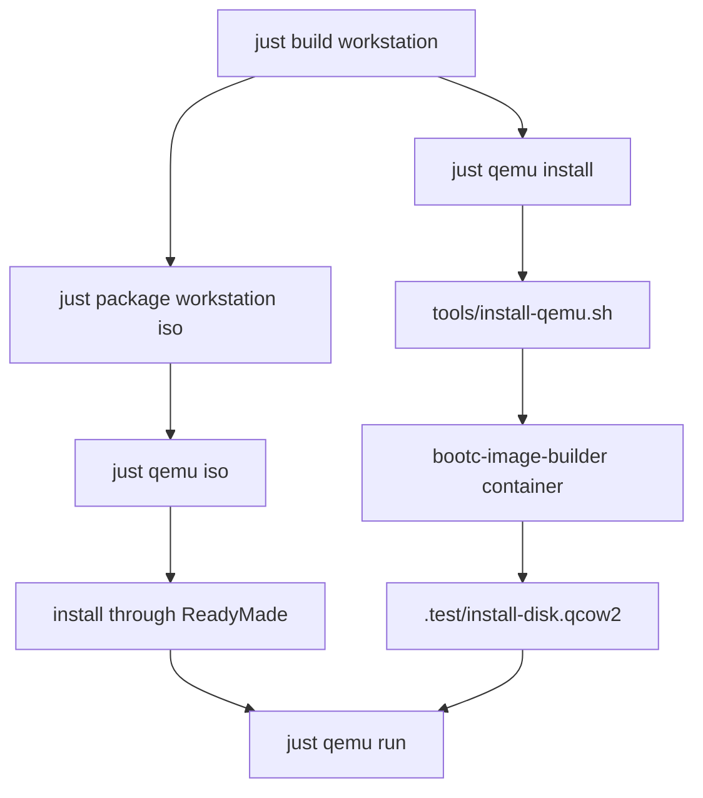

`tools/qemu.sh iso`:

- Selects ISO through `QEMU_ISO_PATH`, `.test/last-iso`, or the newest root-level ISO.
- Creates or reuses `.test/install-disk.qcow2`.
- Boots with OVMF UEFI by default.
- Uses AHCI/SATA by default for firmware compatibility.
- Enables serial logging and `.test/qemu.log` when `QEMU_DEBUG != 0`.

`tools/qemu.sh disk`:

- Boots `QEMU_DISK_PATH`, defaulting to `.test/disk.qcow2`.
- `just qemu run` uses `.test/install-disk.qcow2` and resets NVRAM by default.

`tools/install-qemu.sh`:

- Runs `quay.io/centos-bootc/bootc-image-builder:latest`.
- Mounts local container storage.
- Produces `.test/install-disk.qcow2`.

## Runtime States

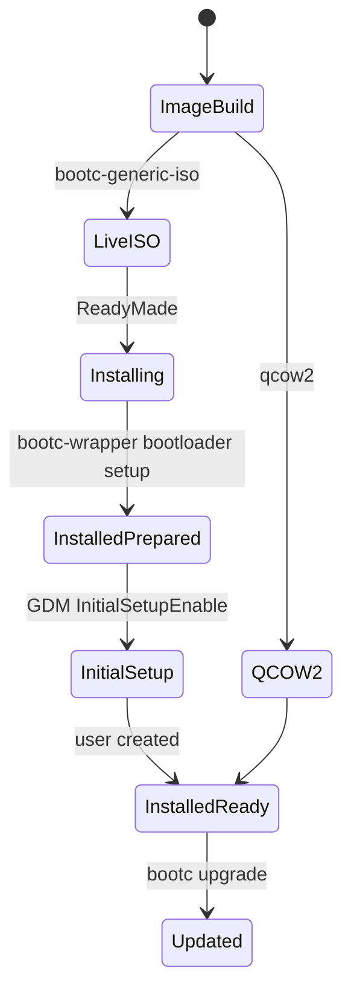

| State | Indicator | Behavior |
| --- | --- | --- |
| Live ISO | `/etc/luminusos/system-mode = live` | `liveuser` autologin, `live-installer` session, ReadyMade visible and autostarted. |
| Installed prepared | `/etc/luminusos/system-mode = installed` | Workstation payload deployed, bootloader configured, GNOME Initial Setup enabled. |
| Installed ready | Real user exists | Normal GNOME login, Aurora Shell defaults, no ReadyMade installer app. |

## Updates

The installed system is a closed bootc deployment. Its update reference comes from `bootc_target_imgref` in `/etc/readymade.toml` during installation, and normal updates are performed with `bootc upgrade` against that OCI reference.

The final image removes the `rpm-ostree` package, so client-side package layering is not available. Package changes must be made in the Containerfiles or build scripts and delivered as a new OCI image.

By default, installed systems track the Fedora-versioned workstation image in GHCR:

```bash
LOS_WORKSTATION_TARGET_IMAGE=ghcr.io/luminusos/luminusos-workstation:44
```

Local installer tests may override `LOS_WORKSTATION_TARGET_IMAGE`, but release builds should leave it on the registry-published reference so installed systems use `bootc upgrade` from the Luminus OS OCI registry.

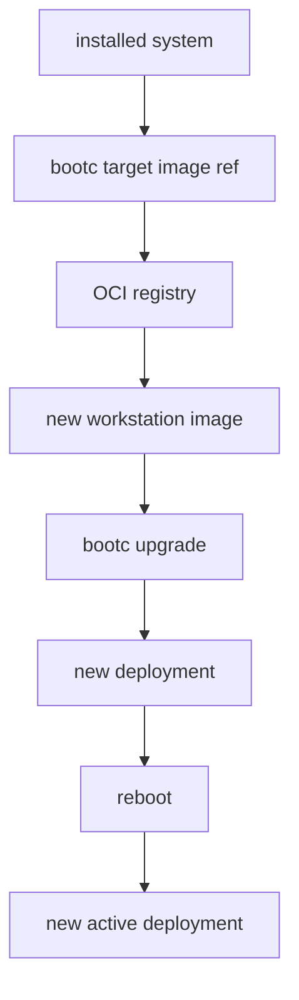

## Consistency Rules

When changing this repository, keep these points aligned:

- `Justfile`, `README.md`, `ARCHITECTURE.md`, and `AGENTS.md` must agree on active commands and supported editions.
- `--bootc-default-fs btrfs` and ReadyMade repart templates must describe the same ISO install storage layout.
- `disk.yaml` must keep root/home/var Btrfs for direct qcow2 artifacts, with `/boot` ext4 for image-builder compatibility.
- Any live-only file added under `editions/workstation/files/` must stay out of the installed workstation payload and be excluded by repart when applicable. `installed-firstboot-cleanup` should only be a fallback, not the primary separation mechanism.
- Changes to `live-installer` must consider the Wayland session file, GNOME session file, GNOME Shell mode JSON, systemd user drop-in, Aurora Shell metadata, and cleanup paths.
- If the ReadyMade desktop file name changes, update GNOME build logic, autostart, cleanup, and repart exclusions.
- If the install flow changes, update `readymade.toml`, wrappers, and this document.

## Operational Commands

```bash
just build core
just build workstation
just package workstation
just package workstation iso
just package workstation qcow2
just qemu iso
just qemu install
just qemu run
```

Useful live ISO commands:

```bash
cat /etc/luminusos/system-mode
hostname
grep bootc_imgref /etc/readymade.toml
sudo podman images
sudo cat /tmp/readymade-logs*/readymade.log
journalctl -b -u gdm
journalctl -b --user -u luminusos-readymade.service
journalctl -b --user /usr/bin/gnome-shell
```

Useful installed-system commands:

```bash
cat /etc/luminusos/system-mode
hostname
bootc status
test ! -e /usr/bin/readymade
test ! -e /usr/share/wayland-sessions/live-installer.desktop
test ! -e /etc/readymade.toml
```

## Known Constraints

- The live ISO itself is not a bootc deployment; `bootc status` is expected after installation.
- ReadyMade is installed only in the ISO live root, not in the installed workstation payload.
- The `live-installer` session depends on a custom GNOME Shell mode; extensions used there must declare support for that mode.
- The install path relies on local wrappers to reconcile live ISO behavior, `bootc install`, and bootupd.
- The direct qcow2 test path does not exercise the ReadyMade UI.
