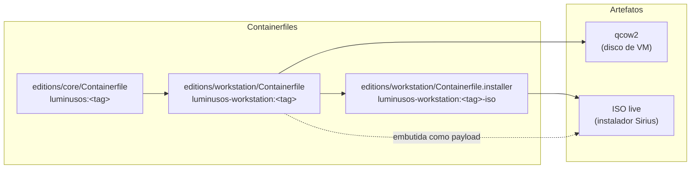
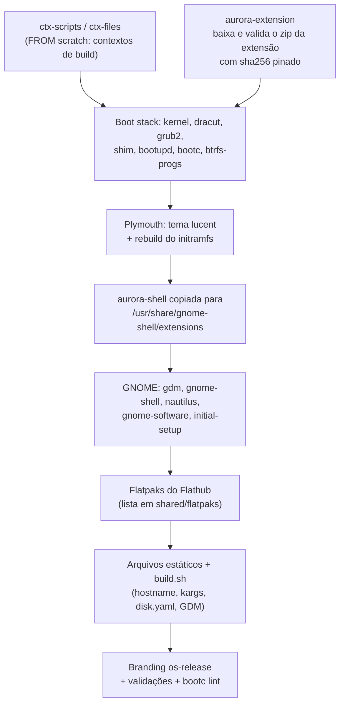
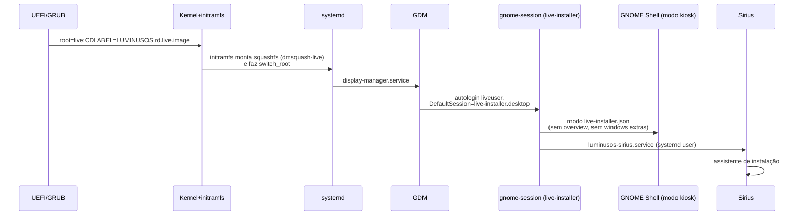
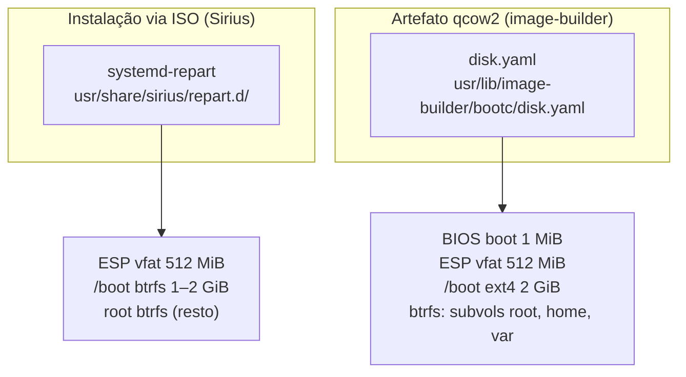
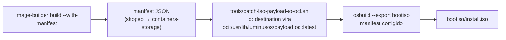
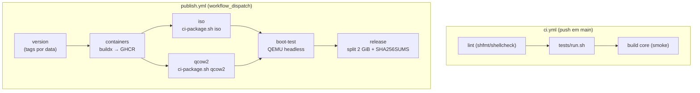
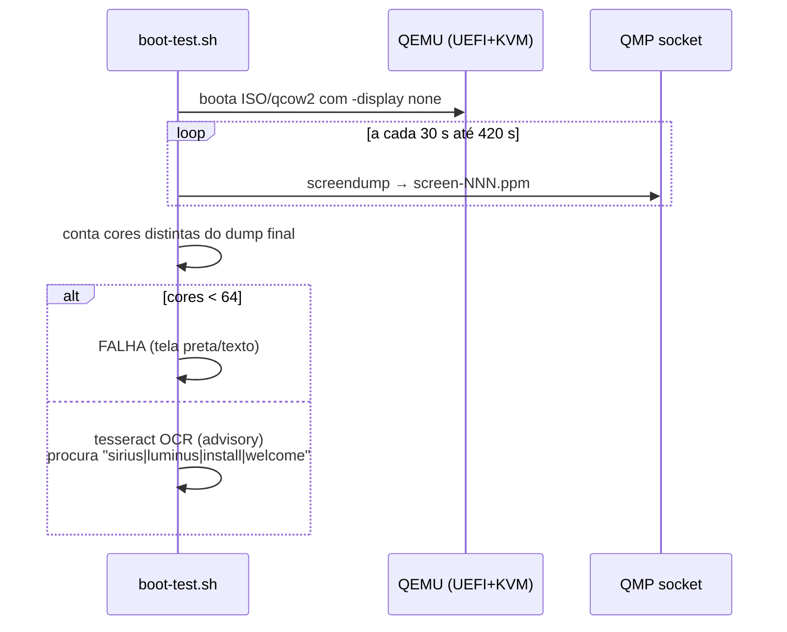
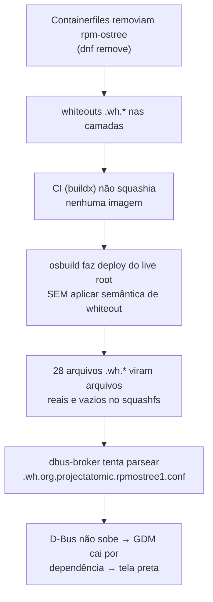

# Luminus OS: Repositório `images/`: Arquitetura, Funcionamento e Decisões Técnicas

> Documento de estudo para TCC. Descreve como o repositório `images/` constrói,
> empacota, testa e publica o Luminus OS, e, principalmente, **por que** cada
> decisão foi tomada. Todos os caminhos citados são relativos a `images/`,
> salvo indicação contrária.

---

## 1. Visão geral

O repositório `images/` é a **fábrica do sistema operacional**. Ele produz três
imagens de contêiner OCI e dois artefatos instaláveis:

| Produto | O que é | Como é consumido |
|---|---|---|
| `luminusos:<tag>` (core) | Imagem bootc mínima, sem desktop | Base da workstation |
| `luminusos-workstation:<tag>` | Imagem bootc com GNOME completo | Sistema instalado (payload) |
| `luminusos-workstation:<tag>-iso` | Live root do instalador | Só existe para gerar a ISO |
| `luminusos-workstation-<tag>.iso` | Instalador live bootável | USB/VM → instala o sistema |
| `luminusos-workstation-<tag>.qcow2` | Disco de VM pronto | Testes e avaliação rápida |



**Decisão central de arquitetura:** a imagem que roda o instalador (`-iso`) e a
imagem que é instalada no disco (payload workstation) são **duas imagens
separadas**. Isso garante que nenhum arquivo do ambiente live (Sirius, sessão
kiosk, usuário `liveuser`) vaze para o sistema instalado: não existe "lista de
exclusão" na instalação porque os arquivos live simplesmente nunca existiram no
payload.

---

## 2. Conceitos fundamentais

### 2.1 bootc e "OSTree native containers"

O Luminus OS é um sistema **imutável baseado em bootc**. A ideia:

- O sistema operacional inteiro é empacotado como uma **imagem de contêiner OCI**
  (a mesma tecnologia do Docker/Podman), com o label `containers.bootc="1"`.
- Na instalação, `bootc install to-filesystem` converte a imagem em um
  deployment OSTree no disco.
- Atualizações são `bootc upgrade`: baixa-se uma nova imagem OCI e reinicia-se
  nela. Rollback é escolher a entrada anterior no GRUB.
- Não há gerenciamento de pacotes no sistema instalado no sentido tradicional:
  mudanças de pacotes acontecem **no Containerfile**, no build da imagem.

**Por que isso importa para o TCC:** o repositório não "monta uma ISO" no
sentido clássico (tipo livemedia-creator com kickstart); ele **constrói
contêineres** e depois os **converte** em artefatos instaláveis com
`image-builder`/`osbuild`.

### 2.2 Camadas OCI e whiteouts

Imagens OCI são pilhas de camadas (layers). Quando uma camada remove um arquivo
que existia numa camada inferior, ela não o "apaga"; ela grava um marcador
chamado **whiteout**: um arquivo vazio chamado `.wh.<nome-do-arquivo>`.
Ferramentas que aplicam camadas (Podman, Docker, kernel overlayfs) interpretam
esses marcadores como "esconda este arquivo".

> Guarde este conceito: ele é o vilão do maior incidente do projeto (seção 10.1).

### 2.3 OSTree e deployments

No disco, o sistema instalado vive em `/ostree`: o conteúdo da imagem vira um
commit OSTree, e diretórios mutáveis (`/var`, `/etc`, `/home`) ficam fora do
controle da imagem. `/usr` é montado read-only em runtime (composefs nos
Fedora bootc atuais).

---

## 3. As três imagens em detalhe

### 3.1 Core: `editions/core/Containerfile`

A imagem mais simples. Parte de `quay.io/fedora/fedora-bootc:44` e faz apenas:

1. `dnf-releasever.sh`: pin de `/etc/dnf/vars/releasever` para garantir que o
   DNF resolva pacotes contra a versão certa do Fedora, independente do default
   da imagem base.
2. `rpmdb-repair.sh`: recupera o banco RPM quando um passo anterior do build
   containerizado deixou um banco temporário (`rpmrebuilddb.*`) para trás
   (problema real e recorrente em builds de imagem bootc).
3. `os-release-set.sh`: branding: `NAME=LuminusOS`, `PRETTY_NAME`, `VERSION`,
   `IMAGE_ID`, etc.
4. Validação final: `command -v bootc` + `bootc container lint`.

**Decisões relevantes:**

- **Branding por último**: os passos de `os-release` ficam no fim do
  Containerfile para que mudanças só de versão reutilizem o cache das camadas
  de pacotes (que mudam raramente). O comentário no arquivo diz exatamente
  isso: *"Dynamic branding stays late so version-only changes reuse package
  layers."*
- **rpm-ostree é mantido**: houve uma remoção que se mostrou equivocada e foi
  revertida. Além de quebrar expectativas de ferramentas do ecossistema, ela
  gerava os whiteouts que derrubaram a ISO (seção 10.1).

### 3.2 Workstation: `editions/workstation/Containerfile`

O sistema desktop instalado. Estágios:



Pontos de decisão:

- **Aurora Shell com integridade pinada**: o zip da extensão é baixado do
  GitHub Releases e conferido com `sha256sum -c`. O comentário explica: *"Release
  tags are mutable; the pinned digest is what actually guarantees we ship the
  artifact we reviewed."* Tags podem ser movidas; o hash não.
- **Initramfs reconstruído duas vezes, de dois jeitos**: aqui (workstation) o
  `rebuild-initramfs.sh` roda **sem** módulos live (sistema instalado); na
  imagem `-iso` ele roda com `--add "plymouth dmsquash-live"` (necessário para
  bootar de mídia live com squashfs).
- **Plymouth "lucent"**: tema próprio em
  `files/usr/share/plymouth/themes/lucent/`, ativado via `plymouth-set-default-theme`
  e embutido no initramfs por `dracut.conf.d/10-luminusos-plymouth.conf`. Os
  kargs `quiet rhgb splash loglevel=3` (em `usr/lib/bootc/kargs.d/`) escondem o
  texto de boot atrás da animação.
- **Flatpaks pré-instalados**: `shared/flatpaks` lista ~25 apps GNOME
  (Loupe, Papers, Calculator, Flatseal, Warehouse etc.) instalados do Flathub
  no build. `skip_flatpaks=1` acelera builds de teste.
- **`build.sh` (editions/workstation/build.sh)** faz a configuração final do
  sistema instalado: define `graphical.target` como default, habilita GDM,
  escreve `/etc/gdm/custom.conf` com `InitialSetupEnable=true` (o GNOME Initial
  Setup cria o usuário real no primeiro boot pós-instalação) e desativa o
  autostart do GNOME Software na primeira sessão.
- **Validações como camadas `RUN`**: o Containerfile termina com `bootc
  container lint` e testes de existência de arquivos. Se algo essencial sumir,
  **o build quebra**, não a ISO.

### 3.3 Live root da ISO: `editions/workstation/Containerfile.installer`

Construída `FROM` a imagem workstation, adiciona **somente** o necessário para
a experiência de instalação:

| Adição | Função |
|---|---|
| `dracut-live`, `livesys-scripts`, `squashfs-tools`, `xorriso` | Boot live (squashfs em RAM) |
| Sirius (RPM do GitHub Releases) | O instalador gráfico |
| `/etc/sirius/distro.toml` + `sirius.toml` | Config do instalador (imagem, branding, gates) |
| Sessão `live-installer` | GNOME em modo kiosk só com o instalador |
| `/etc/gdm/custom.conf` (live) | Autologin de `liveuser` direto na sessão kiosk |
| `repart.d/` (10-root, 20-boot, 30-esp) | Layout de partições da instalação |
| `/usr/lib/image-builder/bootc/iso.yaml` | Label GRUB/cmdline da ISO |
| Initramfs com `dmsquash-live` | Monta o squashfs da mídia live |
| **Estágio final de squash** | `FROM scratch` + `COPY --from=live / /` (seção 10.1) |

**A sessão live em sequência:**



Detalhes da configuração da sessão kiosk:

- `usr/share/wayland-sessions/live-installer.desktop` → `Exec=gnome-session
  --session live-installer`
- `usr/share/gnome-shell/modes/live-installer.json` → `hasOverview: false`,
  `hasRunDialog: false`, painel quase vazio, extensão aurora-shell habilitada
- `luminusos-sirius.service` (systemd **user**) → `ExecStart=/usr/bin/sirius`,
  `Restart=on-failure`
- Regra polkit `50-sirius-live.rules` → `liveuser` executa a ação privilegiada
  de instalação sem senha (senha do liveuser é vazia, `passwd -d`)
- `etc/dconf/db/local.d/00-iso-live-mode` → defaults dconf da sessão live,
  incluindo **`idle-delay=0`**: a tela nunca apaga durante a instalação
  (seção 10.2 conta por quê)

---

## 4. Layout de disco da instalação

Existem **duas descrições** de layout, para dois caminhos diferentes:



- **Via ISO (Sirius + systemd-repart)**: templates em
  `files/usr/share/sirius/repart.d/`: ESP de 512 MiB, `/boot` btrfs de 1–2 GiB
  e o resto btrfs como `/`.
- **Via qcow2 (image-builder)**: `disk.yaml`: inclui partição BIOS boot de
  1 MiB, ESP 512 MiB, `/boot` **ext4** de 2 GiB (o image-builder não suporta
  btrfs em `/boot`) e uma partição btrfs com subvolumes `root`, `home`, `var`.

**Regra de consistência (documentada em AGENTS.md/ARCHITECTURE.md):** os dois
layouts precisam contar a mesma história de storage (btrfs para dados), com a
ressalva do `/boot` ext4 no qcow2. O filesystem usado pelo image-builder vem do
`disk.yaml`, que **sobrepõe** a flag `--bootc-default-fs`; por isso a flag foi
removida dos scripts (ela só gerava o warning *"ignoring --bootc-default-fs"*).

---

## 5. Empacotamento: de contêiner a ISO/qcow2

### 5.1 image-builder e osbuild

O empacotamento usa `image-builder` (CLI do projeto osbuild). Ele:

1. Gera um **manifest osbuild** (JSON descrevendo pipelines e stages: particionar,
   copiar o rootfs do contêiner, instalar bootloader, montar squashfs, xorriso…).
2. Executa o `osbuild` sobre esse manifest para produzir o artefato.

A ISO é do tipo `bootc-generic-iso` e carrega **duas** referências:

- `--bootc-ref` → o live root (`-iso`)
- `--bootc-installer-payload-ref` → o payload workstation embutido na ISO

### 5.2 O payload OCI e a memória (decisão das máquinas com pouca RAM)

Por padrão, o `bootc-generic-iso` embute o payload como um blob de
**containers-storage**. Problema: o containers/storage guarda as camadas já
descompactadas, então na instalação o `bootc install` precisa **re-compactar
cada camada** numa área de staging em `/var/tmp` (~2,5 GiB). Numa live ISO,
`/var/tmp` é RAM. Resultado: a instalação exigia ~6 GB de RAM e um tmpfs
dedicado (`var-tmp.mount`, 75% da RAM).

**Solução adotada:** embutir o payload como **OCI layout** (diretório com os
blobs de camada prontos, no formato aberto da OCI). O `bootc install` então
faz *streaming* dos blobs direto para o disco, sem re-compactação, sem
staging. Isso é o mesmo modelo que o Anaconda usa para payloads ostree-native.

Como o `image-builder` não tem flag para isso, o build faz um **patch no
manifest**:



O script falha alto se não encontrar exatamente **um** stage
`org.osbuild.skopeo` na pipeline `os-tree`: se o formato do manifest mudar
numa versão futura do osbuild/images, o build quebra em vez de reverter
silenciosamente ao comportamento antigo.

Com isso, o gate de RAM do Sirius (`sirius.toml`) caiu de **5 GiB para 2 GiB**:
basta cobrir a sessão GNOME live. O `var-tmp.mount` e o drop-in
`image_copy_tmp_dir` foram removidos por não serem mais necessários.

> O detalhe do sufixo `:latest` no path, e o bug que ele causou, está na
> seção 10.3.

### 5.3 Squash das imagens locais: `tools/squash-image.sh`

Nos builds locais (Justfile), core e workstation passam por
`buildah commit --squash` antes do empacotamento: todas as camadas viram uma
só, o que **processa e elimina whiteouts** antes que cheguem aos artefatos.
A imagem `-iso` não precisa desse passo externo porque o próprio
`Containerfile.installer` se auto-squashia no estágio final (seção 10.1).

---

## 6. Sirius: o instalador

Sirius é o instalador gráfico do Luminus OS (GTK4/libadwaita), consumido como
RPM pré-compilado do GitHub Releases. Dois arquivos o configuram:

**`/etc/sirius/distro.toml`** (templatado no build):

```toml
[bootc]
image = "oci:/usr/lib/luminusos/payload.oci:latest"   # payload embutido na ISO
target_imgref = "ghcr.io/luminusos/luminusos-workstation:44"  # ref de upgrades futuros
enforce_sigpolicy = false   # TODO: assinar imagens (cosign) e ligar
kargs = ["rhgb", "quiet", "splash"]
args = ["--skip-fetch-check"]

[disk]
repart_dir = "/usr/share/sirius/repart.d"
```

A distinção `image` vs `target_imgref` é sutil e importante:

- `image` = **de onde** os bits da instalação vêm (o payload OCI local da ISO).
- `target_imgref` = **qual referência** o sistema instalado registra para
  `bootc upgrade` futuros (a imagem versionada no GHCR).

**`/etc/sirius/sirius.toml`:**

```toml
[pages]
disabled = ["keyboard", "timezone", "user"]   # usuário é criado pelo GNOME Initial Setup

[diagnostics]
require = ["uefi", "ram", "disk_space"]
warn = ["secure_boot", "network", "virt"]
min_ram_gib = 2
```

**Decisão de UX:** o Sirius não cria usuário; ele só particiona e faz o deploy.
Quem cria a conta real é o **GNOME Initial Setup** no primeiro boot do sistema
instalado (habilitado pelo `InitialSetupEnable=true` no GDM da workstation).
Divisão limpa de responsabilidades: o instalador instala, o sistema se apresenta.

---

## 7. Ferramentas de desenvolvimento local

| Comando | O que faz |
|---|---|
| `just build core` | Build + squash da imagem core |
| `just build workstation` | Idem workstation (reusa core se o "stamp" não mudou) |
| `just build workstation-iso` | Build do live root `-iso` |
| `just package workstation iso` | Manifest → patch OCI → osbuild → `.iso` |
| `just package workstation qcow2` | image-builder → `.qcow2` |
| `just qemu iso` | Boota a ISO em QEMU/KVM com disco de instalação |
| `just qemu run` | Boota o disco já instalado |
| `just test` | Suíte `tests/run.sh` (unitária + validação de configs) |
| `just lint` / `just format` | shellcheck / shfmt |

O `Justfile` raiz concentra variáveis compartilhadas, limpeza e qualidade. Os
fluxos maiores ficam separados por domínio em `.just/build.just`,
`.just/package.just` e `.just/qemu.just`, sem alterar a interface pública dos
comandos.

Detalhes de engenharia dos módulos do Just:

- **Core stamp**: um hash dos arquivos de `editions/core` decide se o core
  precisa rebuildar ao buildar a workstation, evitando rebuilds desnecessários.
- **Sudo keepalive**: um loop de `sudo -n true` a cada 60 s evita que a senha
  seja pedida no meio de pipelines longos.
- `tools/qemu.sh`: VM UEFI (OVMF) com KVM, memória configurável
  (`QEMU_MEM=4G`), NVRAM resetável, disco de instalação em `.test/`.
- `tools/install-qemu.sh`: alternativa que instala a imagem num qcow2 via
  `bootc-image-builder` containerizado.
- `tests/run.sh`: roda igual na máquina do dev e no CI: sintaxe bash,
  TOML/JSON/INI válidos, invariantes do repart.d, patch do manifest, parse do
  Justfile.

---

## 8. CI/CD

### 8.1 Workflows



### 8.2 Decisões de CI

- **Builds de contêiner com Docker Buildx + cache `gha`**, push direto para
  GHCR; cada imagem seguinte puxa a anterior do registry (o driver
  container do buildx não enxerga o daemon local).
- **Sem squash no CI para core/workstation**: desnecessário, porque o deploy ostree
  (qcow2) aplica whiteouts corretamente, e a imagem `-iso` se auto-squashia.
- **Empacotamento em contêiner Fedora privilegiado** (`ci-package.sh`): instala
  `image-builder`, `osbuild`, `podman`, `jq` e roda o mesmo fluxo do Justfile
  (manifest → patch OCI → osbuild). O cache do osbuild fica num bind mount do
  runner (`/work/.osbuild-cache`) porque o driver overlay se recusa a rodar
  sobre overlayfs.
- **Release**: assets >2 GB são fatiados em `.partNN` com `SHA256SUMS`
  (limite de 2 GiB/asset do GitHub, vale para todos os planos). A alternativa
  adotada por projetos como Bluefin/Bazzite é hospedar a ISO em object storage
  (Cloudflare R2, egress grátis) e deixar o release só com changelog.

### 8.3 O boot smoke test: `.github/scripts/boot-test.sh`

Teste estilo openQA, sem openQA:



A heurística é elegante: uma tela preta tem 1 cor; um console texto, menos de
32; qualquer superfície GNOME renderizada (gradientes, texto antialiased) tem
centenas. O OCR é apenas informativo; o que falha o teste é a contagem de
cores. Screenshots e serial.log são guardados como evidência.

---

## 9. Mapa de arquivos

```
images/
├── .just/
│   ├── build.just                      # build de core/workstation/live root
│   ├── package.just                    # empacotamento ISO e qcow2
│   └── qemu.just                       # boot e instalação em VM
├── editions/
│   ├── core/Containerfile              # imagem base LuminusOS
│   └── workstation/
│       ├── Containerfile               # desktop instalado (payload)
│       ├── Containerfile.installer     # live root da ISO (auto-squash)
│       ├── build.sh                    # transformações do sistema e targets
│       └── files/                      # árvore de arquivos estáticos
│           ├── etc/sirius/             # distro.toml + sirius.toml
│           ├── etc/gdm/custom.conf     # autologin liveuser (live)
│           ├── etc/dconf/db/local.d/   # defaults dconf da sessão live
│           ├── usr/share/sirius/repart.d/   # layout GPT da instalação
│           ├── usr/lib/image-builder/bootc/ # disk.yaml + iso.yaml
│           └── usr/share/plymouth/themes/lucent/
├── shared/
│   ├── scripts/                        # dnf-releasever, rpmdb-repair,
│   │                                   # rebuild-initramfs, os-release-set…
│   └── flatpaks                        # refs de Flatpaks pré-instalados
├── tools/
│   ├── squash-image.sh                 # buildah commit --squash
│   ├── patch-iso-payload-to-oci.sh     # patch do manifest (payload OCI)
│   ├── qemu.sh / install-qemu.sh       # testes locais em VM
│   └── ci-image-name.sh
├── tests/run.sh                        # suíte dev/CI
├── Justfile                            # entrada, limpeza e qualidade
└── .github/
    ├── workflows/                      # ci, build-containers, publish
    └── scripts/                        # ci-package.sh, boot-test.sh
```

---

## 10. Estudos de caso: incidentes reais e o que ensinam

Estes três incidentes (todos diagnosticados e corrigidos) são excelentes
material de TCC porque mostram como as camadas de abstração interagem.

### 10.1 A tela preta: whiteouts OCI contra o D-Bus

**Sintoma:** a ISO do CI bootava, mostrava o Plymouth e depois ficava numa
tela preta permanente. O boot smoke test falhava com "1 cor distinta".

**Investigação:** boot da ISO em QEMU com console serial mostrou:

```
dbus-broker-launch: Invalid XML in /usr/share/dbus-1/system.d/.wh.org.projectatomic.rpmostree1.conf
Failed to start dbus-broker.service
DEPEND Dependency failed for gdm.service
```

**Cadeia causal:**



**Por que o qcow2 funcionava?** O deploy ostree/bootc do disco **aplica**
whiteouts corretamente; o caminho do live root da ISO não aplicava. Mesmo
build, dois destinos, comportamentos diferentes.

**Correções (dupla defesa):**

1. A remoção do rpm-ostree foi revertida (era equivocada por si só).
2. O `Containerfile.installer` ganhou um estágio final `FROM scratch` +
   `COPY --from=live / /`, que materializa o filesystem mesclado numa única
   camada, tornando estruturalmente impossível vazar whiteout para qualquer `rm`
   futuro em qualquer estágio. Um `find` anti-`.wh.*` no RUN de verificação
   faz o build falhar se algum sobreviver.

**Lição:** consumidores de imagens OCI não são obrigados a honrar whiteouts;
um artefato que será "copiado" por tooling de terceiros deve ser entregue
sem whiteouts (squash).

### 10.2 O teste que falhava com tudo certo: o descanso de tela

**Sintoma:** após a correção dos whiteouts, o boot test ainda falhava, mas os
screenshots mostravam o Sirius perfeitamente até `screen-330.ppm`, e preto do
`screen-360.ppm` em diante.

**Causa:** o default do GNOME (`org.gnome.desktop.session idle-delay = 300`)
apaga a tela após 5 minutos sem entrada. A VM do teste nunca move o mouse:
boot ~60 s + 300 s de idle ≈ tela preta no screendump final (420 s).

**Correção:** no dconf da sessão live (`00-iso-live-mode`, que só existe na
ISO): `idle-delay=0`, `idle-dim=false`, `sleep-inactive-*='nothing'`,
screensaver desabilitado. Uma sessão de instalação não deve nunca se esconder
do usuário: regra de produto, não só de teste.

**Lição:** o ambiente de teste headless expõe defaults pensados para hardware
real com usuário presente. Defaults de energia são decisão de produto.

### 10.3 A instalação que não achava o payload: a tag `latest` invisível

**Sintoma:** após o patch do payload OCI, a instalação morria com:

```
error: Installing to filesystem: Creating ostree deployment: Preparing import:
Fetching manifest: failed to invoke method OpenImage:
no descriptor found for reference "latest"
```

**Causa:** o patch apontava o destination do skopeo para
`/usr/lib/luminusos/payload.oci` **sem tag**. O stage do osbuild repassa o path
direto para `skopeo copy oci:<path>`, e sem tag o skopeo **não escreve** a
anotação `org.opencontainers.image.ref.name` no `index.json`. O
`distro.toml` referencia `...payload.oci:latest`, e o containers/image
procura um descriptor anotado como `latest` e, sem encontrar, aborta.

**Correção:** destination vira `.../payload.oci:latest`. O skopeo tira o
`:latest` do nome do diretório em disco e o grava como ref name na anotação.
Verificado empiricamente com cópia real.

**Bug correlato:** o patch original só existia no Justfile local; o CI
(`ci-package.sh`) continuava embutindo containers-storage. A lógica foi
extraída para `tools/patch-iso-payload-to-oci.sh`, usado pelos dois caminhos.

**Lição:** o formato OCI layout separa "diretório em disco" de "referência
nomeada"; os dois lados do contrato (quem escreve e quem lê o `index.json`)
precisam combinar a tag. E: caminhos de build local e CI devem compartilhar
script, não duplicar lógica.

---

## 11. Decisões técnicas consolidadas (resumo para o TCC)

| Decisão | Alternativa rejeitada | Justificativa |
|---|---|---|
| bootc/OSTree via contêineres OCI | RPM-OSTree tradicional, livemedia-creator | Atualizações atômicas, rollback, build reproduzível com tooling de contêiner |
| Payload e live root separados | Uma imagem única com exclusões | Isolamento estrutural: o instalado nunca contém arquivos live |
| Sirius como RPM de release | Build do Sirius do source | Build da ISO rápido e reproduzível; versão pinada por ARG |
| Payload como OCI layout | containers-storage + tmpfs RAM | Instala em máquinas com ~2 GiB RAM; sem staging de 2,5 GiB |
| Patch do manifest osbuild | Esperar flag upstream no image-builder | Desbloqueio imediato, com falha ruidosa se o formato mudar |
| Auto-squash do live root | Confiar em whiteouts OCI | osbuild não aplica whiteouts; whiteouts vazavam como arquivos reais |
| GNOME Initial Setup cria o usuário | Sirius criar usuário | Separação de responsabilidades; fluxo GNOME padrão |
| dconf live sem screen blank | Defaults GNOME | Instalador nunca pode esconder a tela; também falhava o CI |
| Boot test por contagem de cores + OCR | openQA completo | Dependência zero, roda em qualquer runner; detecta tela preta com 1 métrica |
| aurora-shell com sha256 pinado | Confiar na tag de release | Tags são mutáveis; o digest garante o artifact revisado |
| Branding os-release no fim do build | Branding cedo | Cache de camadas: mudança de versão não invalida camadas de pacotes |
| Split de assets >2 GiB no release | Hospedar ISO no GitHub de outra forma | Limite fixo de 2 GiB/asset do GitHub (todos os planos); R2/S3 é a saída futura |

---

## 12. Glossário rápido

- **bootc**: ferramenta que instala/atualiza sistemas a partir de imagens de
  contêiner OCI.
- **OSTree**: "git para sistemas operacionais": armazena deployments
  versionados e content-addressed.
- **OCI layout**: diretório padronizado (`index.json` + `blobs/`) com uma
  imagem de contêiner descompactada como tarballs de camada.
- **Whiteout**: marcador `.wh.*` em camadas OCI que esconde arquivos de
  camadas inferiores.
- **osbuild / image-builder**: pipeline de construção de artefatos (ISO, qcow2)
  a partir de manifests JSON.
- **skopeo**: ferramenta de cópia/inspeção de imagens entre transports
  (docker://, oci:, containers-storage:).
- **systemd-repart**: particionador declarativo usado pelo Sirius na instalação.
- **live root / payload**: imagem que roda o ambiente live / imagem que é
  instalada no disco.
- **GDM / gnome-session / session mode**: a cadeia que leva do boot à sessão
  kiosk do instalador.
- **Plymouth / dracut**: splash de boot e gerador do initramfs.
